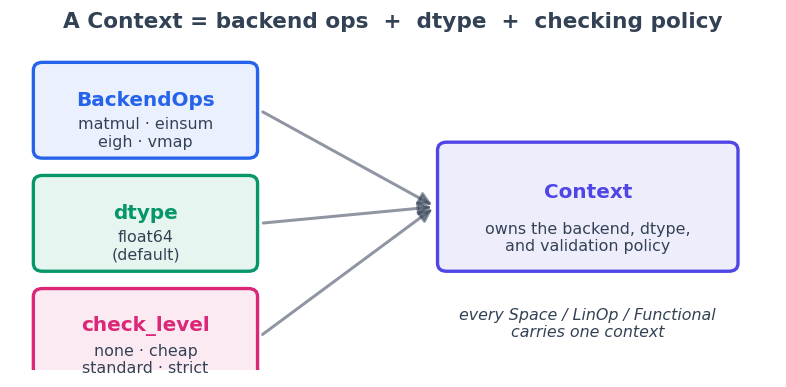
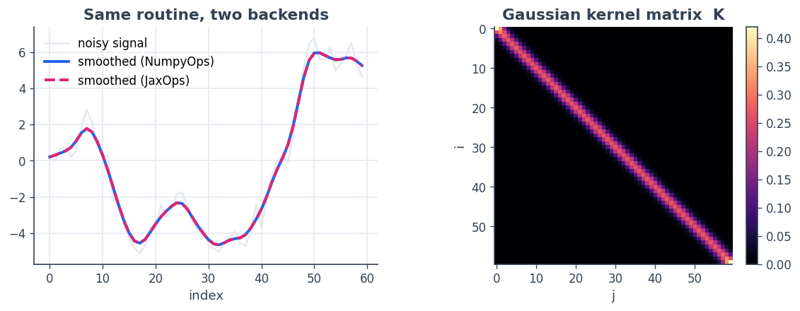
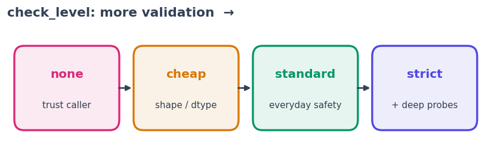

1 · Backend and Context
=======================

   **The idea in one line.** In SpaceCore, *which array library you
   compute with* is an explicit, swappable object — not a hard-wired
   ``import numpy``.

Most numerical Python code bakes a backend into every line:
``np.zeros``, ``np.linalg.solve``, ``jnp.dot``. Moving such code from
NumPy to JAX (for autodiff/JIT/GPU) or to Torch means a rewrite, and the
*rules* of the computation — the dtype, what counts as a valid input —
live only in your head.

SpaceCore pulls those decisions into one place, the **``Context``**:

-  a **``BackendOps``** — the numerical contract (``matmul``,
   ``einsum``, ``eigh``, …) implemented by NumPy, JAX, Torch, or CuPy;
-  a **default ``dtype``** for the arrays you create;
-  a **checking policy** (``check_level``) that decides how much runtime
   validation happens.

Every space, operator, and functional you will meet in the next
tutorials carries a context. This first notebook is about that
foundation: what a context *is*, how to write code that runs unchanged
on two backends, and how to dial validation up or down.

**You will learn to**

1. create a ``Context`` and read its parts;
2. write one function that runs identically on NumPy **and** JAX through
   ``ctx.ops``;
3. use ``check_level`` to make bugs loud (or silent);
4. move an object from one backend to another with ``.convert(...)``.

.. code:: python

    import numpy as np
    import matplotlib as mpl
    import matplotlib.pyplot as plt
    import spacecore as sc
    
    # A clean, consistent palette + style for every figure in the tutorials.
    BLUE, INDIGO, CYAN = "#2563eb", "#4f46e5", "#0891b2"
    PINK, AMBER, GREEN = "#db2777", "#d97706", "#059669"
    SLATE, GRID = "#334155", "#e5e9f0"
    
    mpl.rcParams.update({
        "figure.figsize": (7.2, 4.2), "figure.dpi": 120, "savefig.dpi": 120,
        "figure.facecolor": "white", "axes.facecolor": "white",
        "axes.edgecolor": SLATE, "axes.linewidth": 1.0,
        "axes.grid": True, "axes.axisbelow": True,
        "grid.color": GRID, "grid.linewidth": 1.0,
        "axes.spines.top": False, "axes.spines.right": False,
        "axes.titlesize": 13, "axes.titleweight": "bold", "axes.titlecolor": SLATE,
        "axes.labelcolor": SLATE, "axes.labelsize": 11,
        "xtick.color": SLATE, "ytick.color": SLATE,
        "xtick.labelsize": 10, "ytick.labelsize": 10, "font.size": 11,
        "legend.frameon": False, "legend.fontsize": 10,
        "lines.linewidth": 2.4, "lines.markersize": 6, "image.cmap": "magma",
    })
    mpl.rcParams["axes.prop_cycle"] = mpl.cycler(
        color=[BLUE, PINK, GREEN, AMBER, INDIGO, CYAN])
    
    print("spacecore", sc.__version__, "| numpy", np.__version__)

.. parsed-literal::

    spacecore 0.4.0 | numpy 2.4.2

1 · Anatomy of a context
------------------------

A context bundles three decisions. The picture below is the mental model
to keep.

.. code:: python

    from matplotlib.patches import FancyBboxPatch, FancyArrowPatch
    
    fig, ax = plt.subplots(figsize=(8.2, 3.6)); ax.axis("off")
    ax.set_xlim(0, 10); ax.set_ylim(0, 5)
    
    def box(x, y, w, h, title, sub, color):
        p = FancyBboxPatch((x, y), w, h, boxstyle="round,pad=0.02,rounding_size=0.12",
                           linewidth=2, edgecolor=color, facecolor=color + "18")
        ax.add_patch(p)
        ax.text(x + w/2, y + h*0.62, title, ha="center", va="center",
                fontsize=12, fontweight="bold", color=color)
        ax.text(x + w/2, y + h*0.26, sub, ha="center", va="center", fontsize=9.5, color=SLATE)
    
    box(0.3, 3.2, 2.9, 1.4, "BackendOps", "matmul · einsum\neigh · vmap", BLUE)
    box(0.3, 1.5, 2.9, 1.4, "dtype", "float64\n(default)", GREEN)
    box(0.3, -0.2, 2.9, 1.4, "check_level", "none · cheap\nstandard · strict", PINK)
    box(5.6, 1.5, 3.9, 1.9, "Context", "owns the backend, dtype,\nand validation policy", INDIGO)
    
    for y in (3.9, 2.2, 0.5):
        ax.add_patch(FancyArrowPatch((3.25, y), (5.55, 2.45), arrowstyle="-|>",
                     mutation_scale=16, lw=1.8, color=SLATE, alpha=0.55))
    ax.text(7.55, 0.7, "every Space / LinOp / Functional\ncarries one context",
            ha="center", va="center", fontsize=9.5, style="italic", color=SLATE)
    ax.set_title("A Context = backend ops  +  dtype  +  checking policy", loc="center")
    plt.show()

2 · Create a context and read its parts
---------------------------------------

``Context(ops, dtype=...)`` is all you need. ``NumpyOps`` is always
available; the others (``JaxOps``, ``TorchOps``, ``CuPyOps``) appear
only when their optional dependency is installed.

.. code:: python

    ctx = sc.Context(sc.NumpyOps(), dtype=np.float64)
    
    print("backend family :", ctx.ops.family)
    print("default dtype  :", ctx.dtype)
    print("check level    :", ctx.check_level)   # direct construction defaults to "standard"
    
    # `asarray` materialises data on this backend at this dtype:
    x = ctx.asarray([1.0, 2.0, 3.0])
    print("asarray dtype  :", x.dtype, "->", x)

.. parsed-literal::

    backend family : numpy
    default dtype  : float64
    check level    : standard
    asarray dtype  : float64 -> [1. 2. 3.]

The context never *owns* arrays; it is a small, immutable description of
*how* to make and check them. ``ctx.asarray`` is the canonical way to
bring Python/NumPy data onto the context’s backend and dtype.

3 · ``BackendOps``: one function, two backends
----------------------------------------------

``ctx.ops`` is the numerical contract. If you write your computation
against it instead of against ``numpy`` directly, the *same function*
runs on any backend. Here is a small routine that builds a Gaussian
kernel matrix and smooths a signal — written once.

.. code:: python

    def smooth_with_gaussian(ctx, signal, sigma=1.5):
        """Backend-agnostic: only touches ctx.ops and ctx.asarray."""
        ops = ctx.ops
        x = ctx.asarray(signal)
        n = x.shape[0]
        idx = ops.arange(0, n, dtype=ctx.dtype)
        # pairwise squared distances via broadcasting, then a normalised Gaussian kernel
        d2 = (idx[:, None] - idx[None, :]) ** 2
        K = ops.exp(-d2 / (2.0 * sigma ** 2))
        K = K / ops.sum(K, axis=1)[:, None]
        return ops.matmul(K, x), K
    
    rng = np.random.default_rng(0)
    raw = np.cumsum(rng.standard_normal(60))        # a noisy random walk
    sm_np, K_np = smooth_with_gaussian(ctx, raw)
    print("numpy output dtype:", sm_np.dtype)

.. parsed-literal::

    numpy output dtype: float64

Now run the **exact same function** through a JAX context. We enable
64-bit mode first so JAX matches NumPy’s ``float64`` (JAX defaults to
``float32``).

.. code:: python

    try:
        import jax
        jax.config.update("jax_enable_x64", True)
        ctx_jax = sc.Context(sc.JaxOps(), dtype=jax.numpy.float64)
        sm_jax, K_jax = smooth_with_gaussian(ctx_jax, raw)   # same function, new backend
        max_diff = float(np.max(np.abs(np.asarray(sm_jax) - np.asarray(sm_np))))
        HAVE_JAX = True
        print("jax output type   :", type(sm_jax).__name__)
        print("max abs(numpy - jax):", max_diff)
    except ImportError:
        HAVE_JAX = False
        print("JAX not installed — skipping the JAX backend comparison.")

.. parsed-literal::

    jax output type   : ArrayImpl
    max abs(numpy - jax): 1.7763568394002505e-15

.. parsed-literal::

    W0622 05:48:02.899710 11890930 cpp_gen_intrinsics.cc:74] Empty bitcode string provided for eigen. Optimizations relying on this IR will be disabled.

.. code:: python

    fig, axes = plt.subplots(1, 2, figsize=(9.6, 3.8))
    
    axes[0].plot(raw, color=GRID, lw=1.6, label="noisy signal")
    axes[0].plot(np.asarray(sm_np), color=BLUE, label="smoothed (NumpyOps)")
    if HAVE_JAX:
        axes[0].plot(np.asarray(sm_jax), color=PINK, ls="--", label="smoothed (JaxOps)")
    axes[0].set_title("Same routine, two backends"); axes[0].set_xlabel("index")
    axes[0].legend(loc="upper left")
    
    im = axes[1].imshow(np.asarray(K_np), cmap="magma")
    axes[1].set_title("Gaussian kernel matrix  K"); axes[1].set_xlabel("j"); axes[1].set_ylabel("i")
    axes[1].grid(False)
    fig.colorbar(im, ax=axes[1], fraction=0.046, pad=0.04)
    plt.tight_layout(); plt.show()

The blue (NumPy) and dashed-pink (JAX) curves lie on top of each other
to ~1e-13. The function never mentioned ``numpy`` or ``jax`` — only
``ctx.ops``. That is the whole point of a backend abstraction: **write
the math once, choose the engine later.**

4 · ``check_level``: how loud should bugs be?
---------------------------------------------

A context also carries a validation policy. There are four levels,
cheapest to strictest:

============ ==============================================
level        meaning
============ ==============================================
``none``     no validation — fastest, trust the caller
``cheap``    O(1) structural checks (shape, dtype, backend)
``standard`` the default — the everyday safety net
``strict``   adds expensive probes (e.g. adjoint dot-tests)
============ ==============================================

The same wrong input is caught at ``standard`` but silently accepted at
``none``.

.. code:: python

    ctx_checked = sc.Context(sc.NumpyOps(), dtype=np.float64, check_level="standard")
    ctx_silent  = sc.Context(sc.NumpyOps(), dtype=np.float64, check_level="none")
    
    X_checked = sc.DenseVectorSpace((3,), ctx_checked)
    X_silent  = sc.DenseVectorSpace((3,), ctx_silent)
    
    wrong = np.zeros(4)   # 4 entries for a 3-dimensional space
    
    try:
        X_checked.check_member(wrong)
    except sc.SpaceValidationError as exc:
        print("standard  ->", exc)
    
    X_silent.check_member(wrong)
    print("none      -> accepted silently (no exception raised)")

.. parsed-literal::

    standard  -> Expected shape (3,), got (4,)
    none      -> accepted silently (no exception raised)

.. code:: python

    fig, ax = plt.subplots(figsize=(8.6, 2.4)); ax.axis("off")
    ax.set_xlim(0, 4); ax.set_ylim(0, 1)
    levels = [("none", "trust caller", PINK),
              ("cheap", "shape / dtype", AMBER),
              ("standard", "everyday safety", GREEN),
              ("strict", "+ deep probes", INDIGO)]
    for i, (name, sub, color) in enumerate(levels):
        ax.add_patch(FancyBboxPatch((i + 0.08, 0.2), 0.84, 0.6,
                     boxstyle="round,pad=0.02,rounding_size=0.08",
                     lw=2, edgecolor=color, facecolor=color + "18"))
        ax.text(i + 0.5, 0.58, name, ha="center", fontsize=12, fontweight="bold", color=color)
        ax.text(i + 0.5, 0.35, sub, ha="center", fontsize=9, color=SLATE)
        if i < 3:
            ax.annotate("", xy=(i + 1.06, 0.5), xytext=(i + 0.92, 0.5),
                        arrowprops=dict(arrowstyle="-|>", color=SLATE, lw=1.6))
    ax.set_title("check_level: more validation  →", loc="left")
    plt.show()

Use ``none`` in tight production loops you have already validated, and
``standard``/``strict`` while developing. (Older code used
``enable_checks=True/False``; that still works but is deprecated in
favour of ``check_level``.)

5 · Switching backends with ``.convert(...)``
---------------------------------------------

Because a context is immutable, you do not mutate a backend — you
rebuild an object on a new context. Every SpaceCore object (space,
operator, functional) supports ``.convert(...)``, which accepts a
``Context``, a backend name, or a ``BackendFamily``.

.. code:: python

    X_np = sc.DenseVectorSpace((3,), ctx)            # numpy
    print("original :", X_np.ops.family)
    
    if HAVE_JAX:
        X_to_jax = X_np.convert("jax")               # rebuilt on JAX
        print("converted:", X_to_jax.ops.family, "(new object:", X_to_jax is not X_np, ")")
        print("same ctx returns self:", X_np.convert(ctx) is X_np)
    else:
        print("JAX not available; convert('jax') would rebuild this space on JAX.")

.. parsed-literal::

    original : numpy
    converted: jax (new object: True )
    same ctx returns self: True

Recap
-----

-  A **``Context``** = backend ops + default dtype + checking policy. It
   is immutable and owns no data.
-  Writing code against **``ctx.ops``** (not ``numpy``) makes it
   backend-portable — we ran one routine on NumPy and JAX with identical
   results.
-  **``check_level``** (``none`` → ``strict``) trades speed for safety;
   ``standard`` is the default.
-  **``.convert(...)``** rebuilds any SpaceCore object on another
   backend.

**Next:** :doc:`2 · Linear algebra <02_linear_algebra>` — build
spaces and operators and solve a linear system with conjugate gradients.
