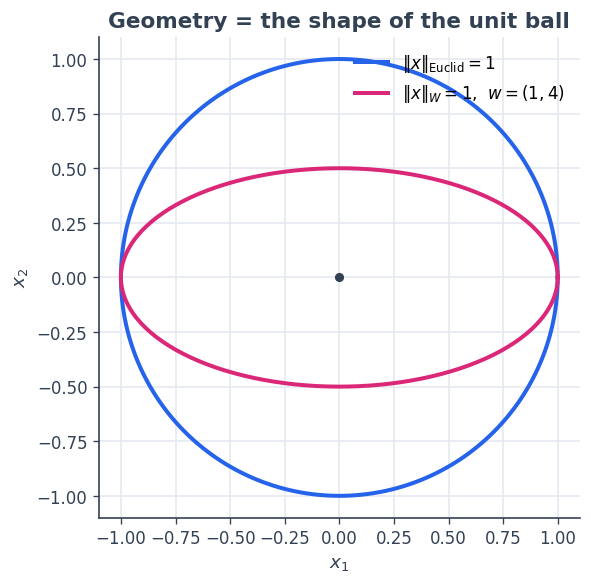
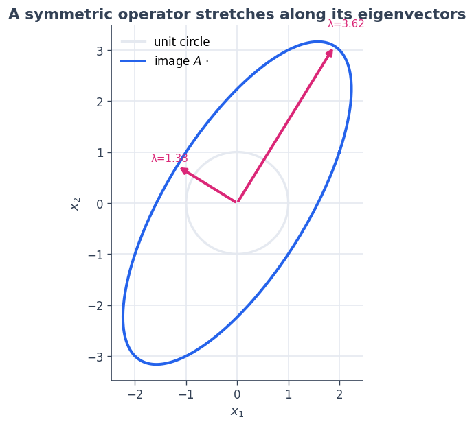
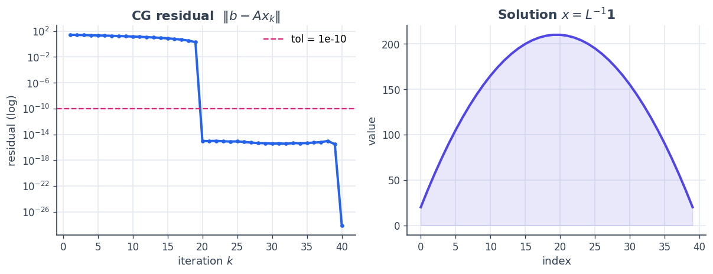

2 · Linear algebra: spaces, operators, conjugate gradients
==========================================================

In SpaceCore a **space** is more than a shape: it knows its geometry
(the inner product), how to validate elements, and how to interpret
adjoints. An **operator** is a *typed map* :math:`A : X \to Y` between
spaces — not just an array.

This notebook builds the two core objects and uses them to solve a
linear system with the conjugate gradient (CG) method, entirely through
SpaceCore.

**You will learn to**

1. create coordinate spaces with Euclidean and weighted geometry;
2. read geometry through ``inner``, ``norm``, and the Riesz map;
3. build operators (``DenseLinOp``, ``DiagonalLinOp``) and apply them
   and their adjoints;
4. solve a symmetric positive-definite system with ``sc.cg`` and watch
   it converge.

.. code:: python

    import numpy as np
    import matplotlib as mpl
    import matplotlib.pyplot as plt
    import spacecore as sc
    
    # A clean, consistent palette + style for every figure in the tutorials.
    BLUE, INDIGO, CYAN = "#2563eb", "#4f46e5", "#0891b2"
    PINK, AMBER, GREEN = "#db2777", "#d97706", "#059669"
    SLATE, GRID = "#334155", "#e5e9f0"
    
    mpl.rcParams.update({
        "figure.figsize": (7.2, 4.2), "figure.dpi": 120, "savefig.dpi": 120,
        "figure.facecolor": "white", "axes.facecolor": "white",
        "axes.edgecolor": SLATE, "axes.linewidth": 1.0,
        "axes.grid": True, "axes.axisbelow": True,
        "grid.color": GRID, "grid.linewidth": 1.0,
        "axes.spines.top": False, "axes.spines.right": False,
        "axes.titlesize": 13, "axes.titleweight": "bold", "axes.titlecolor": SLATE,
        "axes.labelcolor": SLATE, "axes.labelsize": 11,
        "xtick.color": SLATE, "ytick.color": SLATE,
        "xtick.labelsize": 10, "ytick.labelsize": 10, "font.size": 11,
        "legend.frameon": False, "legend.fontsize": 10,
        "lines.linewidth": 2.4, "lines.markersize": 6, "image.cmap": "magma",
    })
    mpl.rcParams["axes.prop_cycle"] = mpl.cycler(
        color=[BLUE, PINK, GREEN, AMBER, INDIGO, CYAN])
    
    print("spacecore", sc.__version__, "| numpy", np.__version__)

.. parsed-literal::

    spacecore 0.4.0 | numpy 2.4.2

.. code:: python

    ctx = sc.Context(sc.NumpyOps(), dtype=np.float64)

1 · A space carries geometry
----------------------------

``DenseVectorSpace((n,), ctx)`` describes one vector in
:math:`\mathbb{R}^n`. With the default geometry the inner product is the
ordinary dot product.

.. code:: python

    X = sc.DenseVectorSpace((3,), ctx)
    x = ctx.asarray([3.0, 4.0, 0.0])
    y = ctx.asarray([0.0, 1.0, 2.0])
    
    print("shape       :", X.shape)
    print("<x, y>      :", X.inner(x, y))     # dot product
    print("||x||       :", X.norm(x))         # sqrt(<x,x>)
    print("euclidean?  :", X.is_euclidean)

.. parsed-literal::

    shape       : (3,)
    <x, y>      : 4.0
    ||x||       : 5.0
    euclidean?  : True

Weighted geometry changes the ruler
~~~~~~~~~~~~~~~~~~~~~~~~~~~~~~~~~~~

A *weighted* inner product keeps the same coordinates but measures them
differently: :math:`\langle x, y\rangle_W = \sum_i w_i\, x_i y_i`. The
geometry shows up visually as the shape of the **unit ball**
:math:`\{x : \|x\|=1\}` — a circle in Euclidean geometry, an ellipse
under weights.

.. code:: python

    w  = ctx.asarray([1.0, 4.0])
    Xe = sc.DenseVectorSpace((2,), ctx)                                   # Euclidean
    Xw = sc.DenseVectorSpace((2,), ctx, geometry=sc.WeightedInnerProduct(w))
    
    theta = np.linspace(0, 2*np.pi, 256)
    circle = np.stack([np.cos(theta), np.sin(theta)])                    # Euclidean unit ball
    ellipse = circle / np.sqrt(np.asarray(w))[:, None]                   # weighted unit ball
    
    fig, ax = plt.subplots(figsize=(5.2, 5.2))
    ax.plot(*circle,  color=BLUE, label=r"$\|x\|_{\mathrm{Euclid}} = 1$")
    ax.plot(*ellipse, color=PINK, label=r"$\|x\|_{W} = 1$,  $w=(1,4)$")
    ax.scatter([0], [0], color=SLATE, s=20, zorder=5)
    ax.set_aspect("equal"); ax.set_title("Geometry = the shape of the unit ball")
    ax.set_xlabel("$x_1$"); ax.set_ylabel("$x_2$"); ax.legend(loc="upper right")
    plt.show()
    
    print("Euclidean ||(0,1)|| :", float(Xe.norm(ctx.asarray([0.0, 1.0]))))
    print("Weighted  ||(0,1)|| :", float(Xw.norm(ctx.asarray([0.0, 1.0]))), " (= sqrt(4))")

.. parsed-literal::

    Euclidean ||(0,1)|| : 1.0
    Weighted  ||(0,1)|| : 2.0  (= sqrt(4))

The **Riesz map** turns a coordinate vector into the dual vector that
represents it under the geometry. For Euclidean geometry it is the
identity; for weights :math:`w` it multiplies by :math:`w`. It is what
makes gradients and adjoints *metric-aware* (you will use it in
tutorials 3 and 6).

.. code:: python

    v = ctx.asarray([1.0, 1.0])
    print("Euclidean riesz:", Xe.riesz(v))   # identity
    print("Weighted  riesz:", Xw.riesz(v))   # multiply by w = (1, 4)

.. parsed-literal::

    Euclidean riesz: [1. 1.]
    Weighted  riesz: [1. 4.]

2 · Operators are typed maps :math:`A : X \to Y`
------------------------------------------------

``DenseLinOp(A, dom, cod, ctx)`` wraps a matrix as a map between
*spaces*. ``apply`` is the forward map; ``rapply`` is the **adjoint with
respect to the spaces’ inner products** (for Euclidean spaces this is
the ordinary transpose; see :doc:`design/geometry <../design/geometry>`
for the metric case).

.. code:: python

    M  = ctx.asarray([[2.0, 1.0],
                      [1.0, 3.0]])
    X2 = sc.DenseVectorSpace((2,), ctx)
    A  = sc.DenseLinOp(M, X2, X2, ctx)
    
    u = ctx.asarray([1.0, 0.0])
    print("A u        :", A.apply(u))
    print("A* (1,1)   :", A.rapply(ctx.asarray([1.0, 1.0])))   # adjoint
    print("hermitian? :", A.is_hermitian())
    
    # A diagonal operator only stores its diagonal:
    D = sc.DiagonalLinOp(ctx.asarray([2.0, 0.5]), X2, ctx)
    print("D (1,1)    :", D.apply(ctx.asarray([1.0, 1.0])))

.. parsed-literal::

    A u        : [2. 1.]
    A* (1,1)   : [3. 4.]
    hermitian? : True
    D (1,1)    : [2.  0.5]

Seeing an operator as a deformation
~~~~~~~~~~~~~~~~~~~~~~~~~~~~~~~~~~~

A linear map sends the unit circle to an ellipse whose axes are the
eigenvectors of :math:`A`, stretched by its eigenvalues. Visualising
that makes “operator” concrete.

.. code:: python

    pts = circle                                    # reuse the unit circle from before
    img = np.asarray(A.to_dense()) @ pts
    evals, evecs = np.linalg.eigh(np.asarray(M))
    
    fig, ax = plt.subplots(figsize=(5.6, 5.6))
    ax.plot(*pts, color=GRID, lw=2, label="unit circle")
    ax.plot(*img, color=BLUE, label=r"image $A\,\cdot$")
    for lam, vec in zip(evals, evecs.T):
        ax.annotate("", xy=lam*vec, xytext=(0, 0),
                    arrowprops=dict(arrowstyle="-|>", color=PINK, lw=2.4))
        ax.text(*(lam*vec*1.12), f"λ={lam:.2f}", color=PINK, fontsize=9, ha="center")
    ax.set_aspect("equal"); ax.set_title("A symmetric operator stretches along its eigenvectors")
    ax.set_xlabel("$x_1$"); ax.set_ylabel("$x_2$"); ax.legend(loc="upper left")
    plt.show()

3 · Solving :math:`A x = b` with conjugate gradients
----------------------------------------------------

``sc.cg`` expects a square, symmetric, positive-definite operator and
solves :math:`Ax = b` using only ``A.apply`` and the domain inner
product — it never forms :math:`A^{-1}`. We build a classic SPD example:
a 1-D discrete Laplacian (tridiagonal :math:`2,-1`).

.. code:: python

    n = 40
    lap = (2.0 * np.eye(n) - np.eye(n, k=1) - np.eye(n, k=-1))
    Xn  = sc.DenseVectorSpace((n,), ctx)
    L   = sc.DenseLinOp(ctx.asarray(lap), Xn, Xn, ctx)
    
    b   = ctx.asarray(np.ones(n))
    res = sc.cg(L, b, tol=1e-10, maxiter=n)
    
    print("converged   :", bool(res.converged))
    print("iterations  :", int(res.num_iters))
    print("residual    :", float(res.residual_norm))
    print("check Ax≈b   :", np.allclose(np.asarray(L.apply(res.x)), np.asarray(b)))

.. parsed-literal::

    converged   : True
    iterations  : 40
    residual    : 7.869487166620889e-29
    check Ax≈b   : True

To *watch* CG converge we ask it for the residual after :math:`k` steps,
for :math:`k = 1, 2, \dots` (re-running from scratch with ``tol=0`` so
it always takes exactly :math:`k` iterations). The residual drops
sharply once CG has explored enough of the Krylov subspace.

.. code:: python

    ks = np.arange(1, n + 1)
    hist = [float(sc.cg(L, b, tol=0.0, atol=0.0, maxiter=int(k), check_every=1).residual_norm)
            for k in ks]
    
    fig, axes = plt.subplots(1, 2, figsize=(10.2, 4.0))
    axes[0].semilogy(ks, hist, color=BLUE, marker="o", ms=3)
    axes[0].axhline(1e-10, color=PINK, ls="--", lw=1.4, label="tol = 1e-10")
    axes[0].set_title("CG residual  $\\|b - A x_k\\|$"); axes[0].set_xlabel("iteration $k$")
    axes[0].set_ylabel("residual (log)"); axes[0].legend()
    
    axes[1].plot(np.asarray(res.x), color=INDIGO)
    axes[1].fill_between(np.arange(n), np.asarray(res.x), color=INDIGO, alpha=0.12)
    axes[1].set_title("Solution $x = L^{-1}\\mathbf{1}$"); axes[1].set_xlabel("index")
    axes[1].set_ylabel("value")
    plt.tight_layout(); plt.show()

The solution is the smooth “tent” you expect from inverting a Laplacian
against a constant load — recovered with a handful of operator
applications and no explicit matrix inverse.

Recap
-----

-  A **space** owns geometry: ``inner``, ``norm``, ``riesz``, and
   ``is_euclidean``. Weighting the inner product reshapes the unit ball.
-  An **operator** :math:`A : X \to Y` has ``apply`` (forward) and
   ``rapply`` (metric adjoint), and can be materialised with
   ``to_dense()``.
-  **``sc.cg``** solves SPD systems matrix-free, using only ``apply``
   and the space’s inner product.

**Next:** :doc:`3 · Functionals <03_functionals>` — scalar
objectives, metric-aware gradients, and gradient descent.
