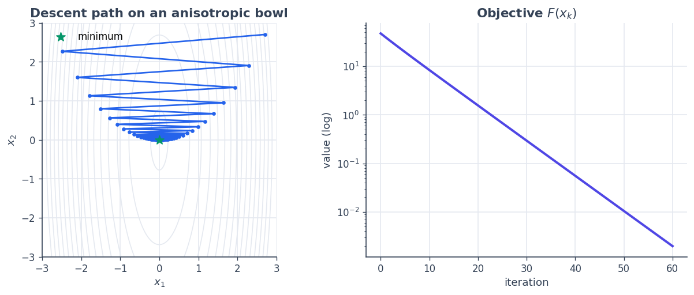
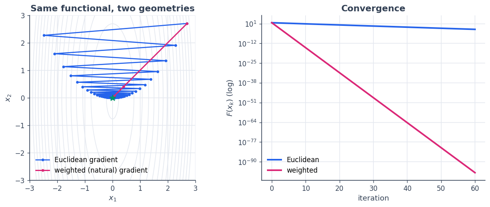

3 · Functionals and gradient descent
====================================

A **functional** is a scalar-valued map :math:`F : X \to \mathbb{R}` —
an objective to minimise. SpaceCore functionals do one thing that
ordinary ``f(x)`` callables do not: their **gradient is an element of
the space**, represented in the space’s own geometry. That single design
choice is what makes ``x \leftarrow x - \eta\,\nabla F(x)`` *correct*
steepest descent, whatever inner product the space carries.

**You will learn to**

1. build functionals (``InnerProductFunctional``,
   ``LinOpQuadraticForm``);
2. write your **own** functional by subclassing ``Functional``;
3. run plain gradient descent and watch it converge on a contour plot;
4. see why the gradient must respect the space geometry.

.. code:: python

    import numpy as np
    import matplotlib as mpl
    import matplotlib.pyplot as plt
    import spacecore as sc
    
    # A clean, consistent palette + style for every figure in the tutorials.
    BLUE, INDIGO, CYAN = "#2563eb", "#4f46e5", "#0891b2"
    PINK, AMBER, GREEN = "#db2777", "#d97706", "#059669"
    SLATE, GRID = "#334155", "#e5e9f0"
    
    mpl.rcParams.update({
        "figure.figsize": (7.2, 4.2), "figure.dpi": 120, "savefig.dpi": 120,
        "figure.facecolor": "white", "axes.facecolor": "white",
        "axes.edgecolor": SLATE, "axes.linewidth": 1.0,
        "axes.grid": True, "axes.axisbelow": True,
        "grid.color": GRID, "grid.linewidth": 1.0,
        "axes.spines.top": False, "axes.spines.right": False,
        "axes.titlesize": 13, "axes.titleweight": "bold", "axes.titlecolor": SLATE,
        "axes.labelcolor": SLATE, "axes.labelsize": 11,
        "xtick.color": SLATE, "ytick.color": SLATE,
        "xtick.labelsize": 10, "ytick.labelsize": 10, "font.size": 11,
        "legend.frameon": False, "legend.fontsize": 10,
        "lines.linewidth": 2.4, "lines.markersize": 6, "image.cmap": "magma",
    })
    mpl.rcParams["axes.prop_cycle"] = mpl.cycler(
        color=[BLUE, PINK, GREEN, AMBER, INDIGO, CYAN])
    
    print("spacecore", sc.__version__, "| numpy", np.__version__)

.. parsed-literal::

    spacecore 0.4.0 | numpy 2.4.2

.. code:: python

    ctx = sc.Context(sc.NumpyOps(), dtype=np.float64)

1 · Built-in functionals
------------------------

The two everyday building blocks are a **linear** functional
:math:`\ell_c(x) = \langle c, x\rangle` and a **quadratic** form.
``LinOpQuadraticForm(Q, linear, a)`` represents

.. math::

    F(x) = \tfrac{1}{2}\,\langle x, Q x\rangle_X + \ell(x) + a,
   \qquad \nabla F(x) = Q x + c, 

where the linear part is itself an ``InnerProductFunctional``. The
gradient comes back as a domain element you can step along directly.

.. code:: python

    X = sc.DenseVectorSpace((3,), ctx)
    
    Q = sc.DiagonalLinOp(ctx.asarray([2.0, 3.0, 5.0]), X, ctx)   # SPD quadratic part
    c = ctx.asarray([1.0, 0.0, -1.0])
    linear = sc.InnerProductFunctional(c, X)                     # ℓ(x) = <c, x>
    F = sc.LinOpQuadraticForm(Q, linear, a=0.5)
    
    x = ctx.asarray([1.0, 2.0, 3.0])
    print("F(x)        :", float(F.value(x)))         # 0.5 xᵀQx + cᵀx + 0.5
    print("grad F(x)   :", F.grad(x))                 # Qx + c
    print("minimiser   :", -np.asarray([1,0,-1]) / np.asarray([2,3,5]))  # -c/diag(Q)
    print("grad at min :", F.grad(ctx.asarray(-np.asarray([1,0,-1]) / np.asarray([2,3,5]))))

.. parsed-literal::

    F(x)        : 28.0
    grad F(x)   : [ 3.  6. 14.]
    minimiser   : [-0.5  0.   0.2]
    grad at min : [0. 0. 0.]

2 · Write your own functional
-----------------------------

To define a custom objective, subclass ``Functional`` and implement
``value``. If you also implement ``grad``, return a **domain element**:
take the raw coordinate gradient :math:`\partial F/\partial x` and pass
it through ``domain.riesz_inverse(...)``. For Euclidean geometry that is
the identity, so the two agree — but writing it this way makes the
functional correct under *any* geometry (we exploit that in §4).

Here is a general quadratic bowl :math:`F(x) = \tfrac12 x^\top H x`.

.. code:: python

    class QuadraticBowl(sc.Functional):
        """F(x) = 0.5 * xᵀ H x, with a metric-aware gradient."""
        def __init__(self, H, dom, ctx=None):
            super().__init__(dom, ctx)
            self.H = self.domain.ctx.asarray(H)
    
        def value(self, x):
            return 0.5 * self.ops.vdot(x, self.ops.matmul(self.H, x))
    
        def grad(self, x):
            coord_grad = self.ops.matmul(self.H, x)          # cotangent  ∂F/∂x = Hx
            return self.domain.riesz_inverse(coord_grad)     # → gradient in the space geometry
    
        # pytree hooks (required): leaves are parameters, aux is static structure
        def tree_flatten(self):
            return (self.H,), (self.domain, self.ctx)
        @classmethod
        def tree_unflatten(cls, aux, children):
            dom, ctx = aux
            return cls(children[0], dom, ctx)
    
    H = np.array([[3.0, 0.0], [0.0, 1.0]])
    X2 = sc.DenseVectorSpace((2,), ctx)
    bowl = QuadraticBowl(H, X2)
    print("value at (2,2):", float(bowl.value(ctx.asarray([2.0, 2.0]))))
    print("grad  at (2,2):", bowl.grad(ctx.asarray([2.0, 2.0])))

.. parsed-literal::

    value at (2,2): 8.0
    grad  at (2,2): [6. 2.]

3 · Gradient descent
--------------------

With a metric-correct gradient in hand, descent is the textbook loop. We
minimise an anisotropic bowl (it is :math:`12\times` steeper in
:math:`x_1` than :math:`x_2`) and record the path.

.. code:: python

    def gradient_descent(F, x0, step, n_steps):
        x = x0
        xs, fs = [np.asarray(x).copy()], [float(F.value(x))]
        for _ in range(n_steps):
            x = x - step * F.grad(x)          # F.grad returns a domain element → valid step
            xs.append(np.asarray(x).copy()); fs.append(float(F.value(x)))
        return np.array(xs), np.array(fs)
    
    H = np.array([[12.0, 0.0], [0.0, 1.0]])
    bowl = QuadraticBowl(H, X2)
    path, vals = gradient_descent(bowl, ctx.asarray([2.7, 2.7]), step=0.16, n_steps=60)
    
    # contour field (F is just 0.5 xᵀHx, evaluated on a grid)
    g = np.linspace(-3, 3, 240); GX, GY = np.meshgrid(g, g)
    Z = 0.5 * (H[0, 0] * GX**2 + H[1, 1] * GY**2)
    
    fig, axes = plt.subplots(1, 2, figsize=(10.6, 4.4))
    axes[0].contour(GX, GY, Z, levels=np.linspace(0.3, 50, 16), colors=GRID, linewidths=1)
    axes[0].plot(path[:, 0], path[:, 1], color=BLUE, marker="o", ms=3, lw=1.6)
    axes[0].scatter([0], [0], color=GREEN, s=90, marker="*", zorder=6, label="minimum")
    axes[0].set_aspect("equal"); axes[0].set_title("Descent path on an anisotropic bowl")
    axes[0].set_xlabel("$x_1$"); axes[0].set_ylabel("$x_2$"); axes[0].legend()
    
    axes[1].semilogy(vals, color=INDIGO)
    axes[1].set_title("Objective $F(x_k)$"); axes[1].set_xlabel("iteration")
    axes[1].set_ylabel("value (log)")
    plt.tight_layout(); plt.show()
    print("final point:", path[-1], " final value:", vals[-1])

.. parsed-literal::

    final point: [1.81398380e-02 7.72895765e-05]  final value: 0.0019743253289275227

The path zig-zags: a single Euclidean step size cannot suit both the
steep :math:`x_1` and the shallow :math:`x_2` direction at once. That is
a *geometry* problem — and SpaceCore lets us fix it by changing the
inner product.

4 · Gradients respect the geometry
----------------------------------

Choosing the inner product is choosing a **preconditioner**. If we give
the space the weighted geometry :math:`W = \mathrm{diag}(H)`, the *same*
``QuadraticBowl`` code now produces the gradient :math:`W^{-1} H x` —
because ``grad`` ends in ``domain.riesz_inverse(...)``. Steepest descent
in this metric heads almost straight at the minimum. Nothing in the
functional changed; only the space did.

.. code:: python

    w = ctx.asarray(np.diag(H))                         # weights = (12, 1)
    Xw = sc.DenseVectorSpace((2,), ctx, geometry=sc.WeightedInnerProduct(w))
    
    bowl_e = QuadraticBowl(H, X2)                       # Euclidean space
    bowl_w = QuadraticBowl(H, Xw)                       # weighted space — identical class!
    
    path_e, val_e = gradient_descent(bowl_e, ctx.asarray([2.7, 2.7]), step=0.16, n_steps=60)
    path_w, val_w = gradient_descent(bowl_w, ctx.asarray([2.7, 2.7]), step=0.85, n_steps=60)
    
    fig, axes = plt.subplots(1, 2, figsize=(10.6, 4.4))
    axes[0].contour(GX, GY, Z, levels=np.linspace(0.3, 50, 16), colors=GRID, linewidths=1)
    axes[0].plot(path_e[:, 0], path_e[:, 1], color=BLUE, marker="o", ms=3, lw=1.6,
                 label="Euclidean gradient")
    axes[0].plot(path_w[:, 0], path_w[:, 1], color=PINK, marker="o", ms=3, lw=1.8,
                 label="weighted (natural) gradient")
    axes[0].scatter([0], [0], color=GREEN, s=90, marker="*", zorder=6)
    axes[0].set_aspect("equal"); axes[0].set_title("Same functional, two geometries")
    axes[0].set_xlabel("$x_1$"); axes[0].set_ylabel("$x_2$"); axes[0].legend()
    
    axes[1].semilogy(val_e, color=BLUE, label="Euclidean")
    axes[1].semilogy(val_w, color=PINK, label="weighted")
    axes[1].set_title("Convergence"); axes[1].set_xlabel("iteration")
    axes[1].set_ylabel("$F(x_k)$ (log)"); axes[1].legend()
    plt.tight_layout(); plt.show()
    print("Euclidean final value:", val_e[-1])
    print("weighted  final value:", val_w[-1])

.. parsed-literal::

    Euclidean final value: 0.0019743253289275227
    weighted  final value: 6.406074302637951e-98

The pink path — steepest descent under the metric matched to the problem
— converges orders of magnitude faster than the blue Euclidean path,
with no change to the objective. This is the seed of **Riemannian /
natural-gradient** optimisation, which :doc:`tutorial 7 <07_manifold_descent>` develops on a curved manifold.

Recap
-----

-  A **``Functional``** is a scalar map whose ``grad(x)`` is a *domain
   element*, so ``x - η·grad`` is a valid step.
-  Build them with ``InnerProductFunctional`` / ``LinOpQuadraticForm``,
   or **subclass ``Functional``** and implement ``value`` (+ optionally
   ``grad``).
-  When you write ``grad`` by hand, finish with
   ``domain.riesz_inverse(coord_grad)`` so it is correct in any
   geometry.
-  Choosing the inner product preconditions descent — the same code
   converges far faster under a fitted metric.

**Next:** :doc:`4 · Tree spaces <04_tree_spaces>` — structured
elements and block operators.
