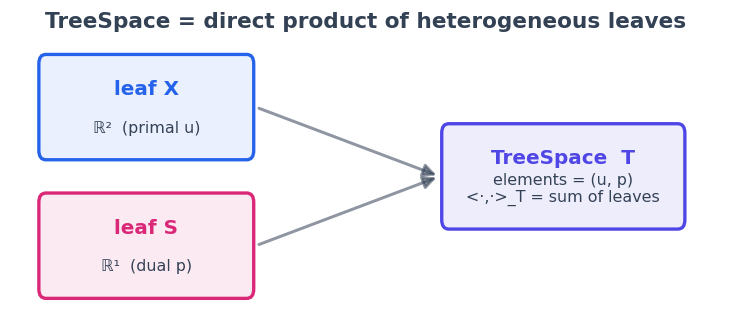
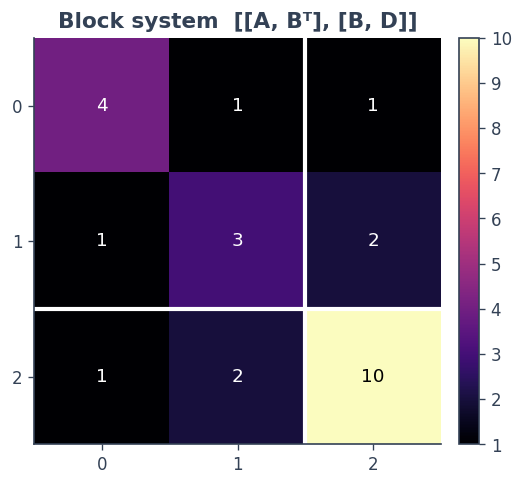
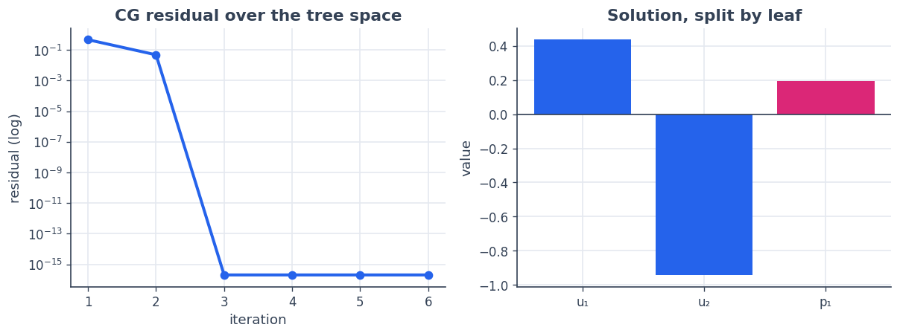

4 · Tree spaces: structured elements and block operators
========================================================

Not every unknown is a flat vector. A saddle-point system has a *primal*
block and a *dual* block of different sizes; a PDE solve might carry a
field plus a handful of scalar multipliers. A **``TreeSpace``** is the
direct product of heterogeneous leaf spaces, organised as a Python tree
(a tuple, list, dict, or ``NamedTuple``). Its elements are trees of
arrays; its inner product is the **sum of the leaf inner products**; and
**block operators** map one tree space to another.

We will assemble a :math:`2\times 2` block SPD system

.. math::

    \begin{pmatrix} A & B^\top \\ B & D \end{pmatrix}
      \begin{pmatrix} u \\ p \end{pmatrix} =
      \begin{pmatrix} f \\ g \end{pmatrix}, 

with :math:`u \in \mathbb{R}^2` and :math:`p \in \mathbb{R}^1` living in
different leaves, and solve it with ``sc.cg`` directly over the tree
space.

**You will learn to** build a ``TreeSpace`` and ``TreeElement``, compose
blocks with ``BlockMatrixLinOp``, and run a Krylov solver over
structured unknowns.

.. code:: python

    import numpy as np
    import matplotlib as mpl
    import matplotlib.pyplot as plt
    import spacecore as sc
    
    # A clean, consistent palette + style for every figure in the tutorials.
    BLUE, INDIGO, CYAN = "#2563eb", "#4f46e5", "#0891b2"
    PINK, AMBER, GREEN = "#db2777", "#d97706", "#059669"
    SLATE, GRID = "#334155", "#e5e9f0"
    
    mpl.rcParams.update({
        "figure.figsize": (7.2, 4.2), "figure.dpi": 120, "savefig.dpi": 120,
        "figure.facecolor": "white", "axes.facecolor": "white",
        "axes.edgecolor": SLATE, "axes.linewidth": 1.0,
        "axes.grid": True, "axes.axisbelow": True,
        "grid.color": GRID, "grid.linewidth": 1.0,
        "axes.spines.top": False, "axes.spines.right": False,
        "axes.titlesize": 13, "axes.titleweight": "bold", "axes.titlecolor": SLATE,
        "axes.labelcolor": SLATE, "axes.labelsize": 11,
        "xtick.color": SLATE, "ytick.color": SLATE,
        "xtick.labelsize": 10, "ytick.labelsize": 10, "font.size": 11,
        "legend.frameon": False, "legend.fontsize": 10,
        "lines.linewidth": 2.4, "lines.markersize": 6, "image.cmap": "magma",
    })
    mpl.rcParams["axes.prop_cycle"] = mpl.cycler(
        color=[BLUE, PINK, GREEN, AMBER, INDIGO, CYAN])
    
    print("spacecore", sc.__version__, "| numpy", np.__version__)

.. parsed-literal::

    spacecore 0.4.0 | numpy 2.4.2

.. code:: python

    ctx = sc.Context(sc.NumpyOps(), dtype=np.float64)

1 · A space made of spaces
--------------------------

``TreeSpace.from_leaf_spaces((X, S))`` glues leaf spaces into a
tuple-structured product. An element is just a tuple ``(u, p)`` of leaf
arrays.

.. code:: python

    X = sc.DenseVectorSpace((2,), ctx)        # primal leaf  u ∈ ℝ²
    S = sc.DenseVectorSpace((1,), ctx)        # dual leaf    p ∈ ℝ¹
    T = sc.TreeSpace.from_leaf_spaces((X, S), ctx)
    
    u = (ctx.asarray([1.0, 2.0]), ctx.asarray([3.0]))
    v = (ctx.asarray([4.0, 5.0]), ctx.asarray([6.0]))
    
    print("leaf paths :", T.leaf_paths)
    print("<u, v>_T   :", T.inner(u, v), " (= 1·4 + 2·5 + 3·6 — sum over leaves)")
    print("||u||_T    :", T.norm(u))
    print("flatten    :", T.flatten(u), " (tree → one dense vector)")
    print("zeros      :", T.zeros())
    
    el = sc.TreeElement(T, u)                 # an explicit element bound to its space
    print("element    :", el.value)

.. parsed-literal::

    leaf paths : ((0,), (1,))
    <u, v>_T   : 32.0  (= 1·4 + 2·5 + 3·6 — sum over leaves)
    ||u||_T    : 3.7416573867739413
    flatten    : [1. 2. 3.]  (tree → one dense vector)
    zeros      : (array([0., 0.]), array([0.]))
    element    : (array([1., 2.]), array([3.]))

.. code:: python

    from matplotlib.patches import FancyBboxPatch, FancyArrowPatch
    fig, ax = plt.subplots(figsize=(7.6, 3.0)); ax.axis("off")
    ax.set_xlim(0, 10); ax.set_ylim(0, 3)
    
    def box(x, y, w, h, t, s, color):
        ax.add_patch(FancyBboxPatch((x, y), w, h, boxstyle="round,pad=0.02,rounding_size=0.1",
                     lw=2, edgecolor=color, facecolor=color + "18"))
        ax.text(x+w/2, y+h*0.62, t, ha="center", fontsize=12, fontweight="bold", color=color)
        ax.text(x+w/2, y+h*0.25, s, ha="center", fontsize=9.5, color=SLATE)
    
    box(0.4, 1.7, 3.0, 1.1, "leaf X", "ℝ²  (primal u)", BLUE)
    box(0.4, 0.2, 3.0, 1.1, "leaf S", "ℝ¹  (dual p)", PINK)
    box(6.1, 0.95, 3.4, 1.1, "TreeSpace  T", "elements = (u, p)\n<·,·>_T = sum of leaves", INDIGO)
    for y in (2.25, 0.75):
        ax.add_patch(FancyArrowPatch((3.45, y), (6.05, 1.5), arrowstyle="-|>",
                     mutation_scale=16, lw=1.8, color=SLATE, alpha=0.55))
    ax.set_title("TreeSpace = direct product of heterogeneous leaves", loc="center")
    plt.show()

2 · Block operators over the tree
---------------------------------

Each block is an ordinary ``DenseLinOp`` between leaves;
``BlockMatrixLinOp`` arranges them into a single map :math:`T \to T`
with :math:`y_i = \sum_j A_{ij}\, x_j`.

.. code:: python

    Amat = np.array([[4.0, 1.0], [1.0, 3.0]])     # X → X
    Bmat = np.array([[1.0, 2.0]])                  # X → S
    Dmat = np.array([[10.0]])                      # S → S
    
    A_op  = sc.DenseLinOp(ctx.asarray(Amat),   X, X, ctx)
    Bt_op = sc.DenseLinOp(ctx.asarray(Bmat.T), S, X, ctx)   # Bᵀ : S → X
    B_op  = sc.DenseLinOp(ctx.asarray(Bmat),   X, S, ctx)   # B  : X → S
    D_op  = sc.DenseLinOp(ctx.asarray(Dmat),   S, S, ctx)
    
    M = sc.BlockMatrixLinOp([[A_op, Bt_op],
                             [B_op, D_op]])
    print("M : T → T  square?", M.dom == M.cod)
    print("M·(u,p)         :", M.apply((ctx.asarray([1.0, 0.0]), ctx.asarray([1.0]))))

.. parsed-literal::

    M : T → T  square? True
    M·(u,p)         : (array([5., 3.]), array([11.]))

.. code:: python

    full = np.block([[Amat, Bmat.T], [Bmat, Dmat]])     # dense reference, for the picture
    fig, ax = plt.subplots(figsize=(4.8, 4.4))
    im = ax.imshow(full, cmap="magma")
    for i in range(full.shape[0]):
        for j in range(full.shape[1]):
            ax.text(j, i, f"{full[i,j]:.0f}", ha="center", va="center",
                    color="white" if full[i,j] < 7 else "black", fontsize=11)
    # block separators between the X (size 2) and S (size 1) leaves
    ax.axhline(1.5, color="white", lw=2.5); ax.axvline(1.5, color="white", lw=2.5)
    ax.set_xticks(range(3)); ax.set_yticks(range(3)); ax.grid(False)
    ax.set_title("Block system  [[A, Bᵀ], [B, D]]")
    fig.colorbar(im, fraction=0.046, pad=0.04); plt.show()
    print("eigenvalues:", np.round(np.linalg.eigvalsh(full), 3), "→ SPD, so CG applies")

.. parsed-literal::

    eigenvalues: [ 2.165  4.081 10.755] → SPD, so CG applies

3 · Solve it with conjugate gradients over the tree
---------------------------------------------------

``sc.cg`` does not care that the unknown is a tree — it only needs
``M.apply`` and the tree inner product. The right-hand side and the
solution are tree elements.

.. code:: python

    b = (ctx.asarray([1.0, -2.0]), ctx.asarray([0.5]))     # RHS as a tree element
    res = sc.cg(M, b, tol=1e-12, maxiter=50)
    
    print("converged :", bool(res.converged), " iterations:", int(res.num_iters))
    print("u block   :", res.x[0])
    print("p block   :", res.x[1])
    
    # cross-check against a plain dense solve on the flattened system
    ref = np.linalg.solve(full, np.array([1.0, -2.0, 0.5]))
    print("matches dense solve:", np.allclose(T.flatten(res.x), ref))

.. parsed-literal::

    converged : True  iterations: 4
    u block   : [ 0.43684211 -0.94210526]
    p block   : [0.19473684]
    matches dense solve: True

.. code:: python

    ks = np.arange(1, 7)
    hist = [float(sc.cg(M, b, tol=0.0, atol=0.0, maxiter=int(k), check_every=1).residual_norm)
            for k in ks]
    
    fig, axes = plt.subplots(1, 2, figsize=(10.2, 3.9))
    axes[0].semilogy(ks, hist, color=BLUE, marker="o")
    axes[0].set_title("CG residual over the tree space"); axes[0].set_xlabel("iteration")
    axes[0].set_ylabel("residual (log)")
    
    labels = ["u₁", "u₂", "p₁"]
    axes[1].bar(labels, T.flatten(res.x), color=[BLUE, BLUE, PINK])
    axes[1].axhline(0, color=SLATE, lw=1)
    axes[1].set_title("Solution, split by leaf"); axes[1].set_ylabel("value")
    plt.tight_layout(); plt.show()

The two ``u`` bars (blue) and the ``p`` bar (pink) come back in their
own leaves — the solver never flattened your problem into an anonymous
vector.

4 · Named blocks
----------------

A tuple tree is fine, but the blocks here *mean* something — a primal
**state** and a dual **multiplier**. A ``TreeSpace`` can carry that
naming: build it from a ``NamedTuple`` template with ``from_template``,
and elements round-trip as that type, so you read blocks **by name**
instead of by position. The geometry, operators, and solvers are exactly
the same — only your access pattern changes.

.. code:: python

    from typing import NamedTuple
    
    class KKT(NamedTuple):
        state: object        # the u block, in X = ℝ²
        multiplier: object   # the p block, in S = ℝ¹
    
    T_named = sc.TreeSpace.from_template(KKT(0, 0), (X, S), ctx=ctx)
    
    xb = T_named.element(KKT(state=ctx.asarray([1.0, 2.0]),
                             multiplier=ctx.asarray([3.0])))
    
    print("element type :", type(xb.value).__name__)         # KKT — the original type
    print("read by name :", xb.value.state, "|", xb.value.multiplier)
    print("inner         :", T_named.inner(xb.value, xb.value))
    print("same as tuple :", float(T_named.inner(xb.value, xb.value))
                              == float(T.inner((xb.value.state, xb.value.multiplier),
                                               (xb.value.state, xb.value.multiplier))))

.. parsed-literal::

    element type : KKT
    read by name : [1. 2.] | [3.]
    inner         : 14.0
    same as tuple : True

Dicts work as well —
``sc.TreeSpace({"state": 0, "multiplier": 0}, (X, S), ctx=ctx)`` — with
one caveat: dict leaves are ordered by **sorted key**, so check
``T.leaf_paths`` to confirm how ``leaf_spaces`` pairs up. A
``NamedTuple`` keeps your declared field order, which is usually what
you want.

Recap
-----

-  A **``TreeSpace``** is a direct product of heterogeneous leaves;
   elements are Python trees and ``inner``/``norm`` sum over leaves.
   ``flatten``/``unflatten`` bridge to a plain vector.
-  **``BlockMatrixLinOp``** (and friends ``BlockDiagonalLinOp``,
   ``StackedLinOp``, ``SumToSingleLinOp``) compose leaf operators into
   maps between tree spaces.
-  Solvers like **``sc.cg``** run unchanged over tree spaces — structure
   is preserved end to end.

**Next:** :doc:`5 · Weighted Tikhonov <05_weighted_tikhonov>` — a
worked inverse problem where the *metric adjoint* does the heavy
lifting.
