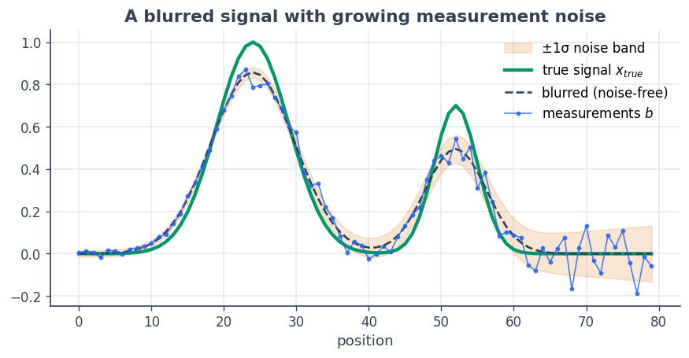
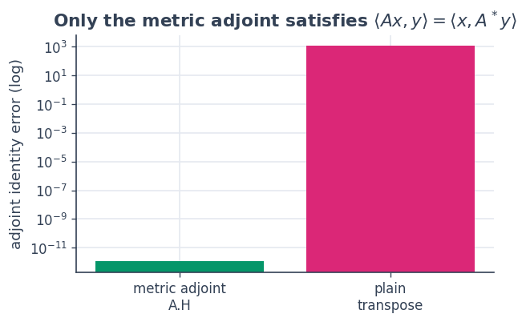
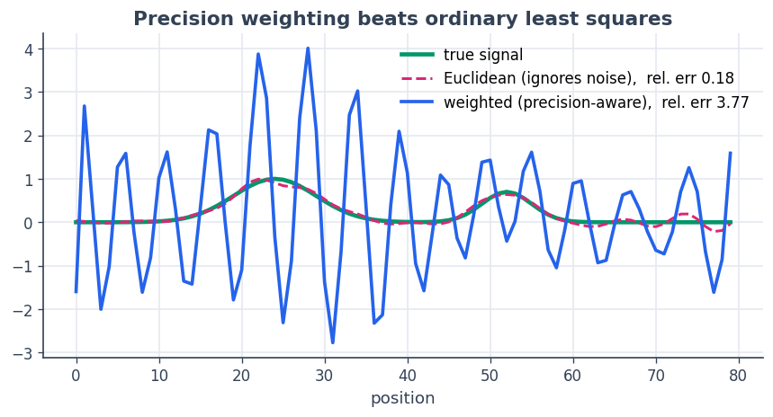
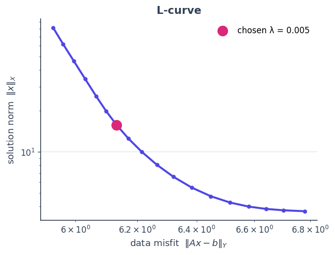

5 · Weighted Tikhonov: an inverse problem with metric adjoints
==============================================================

This is the worked example that ties the foundations together. We
**deblur a noisy signal**: we observe :math:`b \approx A x` where
:math:`A` is a blur and the measurement noise is *heteroscedastic* (some
sensors are far noisier than others). We recover :math:`x` with weighted
Tikhonov regularisation

.. math::  \min_x \; \tfrac{1}{2}\,\lVert A x - b\rVert_Y^2 \;+\; \tfrac{\lambda}{2}\,\lVert x\rVert_X^2 . 

The two norms are **non-Euclidean on purpose**:
:math:`\lVert\cdot\rVert_Y` weights each measurement by its *precision*
:math:`1/\sigma_i^2` (trust clean sensors, discount noisy ones), and
:math:`\lVert\cdot\rVert_X` encodes a prior. The moment the geometry is
non-Euclidean, the adjoint is **no longer the transpose** — it is the
metric adjoint :math:`A^\* = G_X^{-1} A^\top G_Y`. SpaceCore’s ``A.H``
*is* that metric adjoint, so the normal equations

.. math::  (A^\* A + \lambda I)\,x = A^\* b 

carry the weights automatically. We assemble them with operator algebra
and solve with ``sc.cg``.

**You will learn to** build operators between weighted spaces, rely on
the metric adjoint, and see — visually — why ignoring the geometry gives
a worse answer.

.. code:: python

    import numpy as np
    import matplotlib as mpl
    import matplotlib.pyplot as plt
    import spacecore as sc
    
    # A clean, consistent palette + style for every figure in the tutorials.
    BLUE, INDIGO, CYAN = "#2563eb", "#4f46e5", "#0891b2"
    PINK, AMBER, GREEN = "#db2777", "#d97706", "#059669"
    SLATE, GRID = "#334155", "#e5e9f0"
    
    mpl.rcParams.update({
        "figure.figsize": (7.2, 4.2), "figure.dpi": 120, "savefig.dpi": 120,
        "figure.facecolor": "white", "axes.facecolor": "white",
        "axes.edgecolor": SLATE, "axes.linewidth": 1.0,
        "axes.grid": True, "axes.axisbelow": True,
        "grid.color": GRID, "grid.linewidth": 1.0,
        "axes.spines.top": False, "axes.spines.right": False,
        "axes.titlesize": 13, "axes.titleweight": "bold", "axes.titlecolor": SLATE,
        "axes.labelcolor": SLATE, "axes.labelsize": 11,
        "xtick.color": SLATE, "ytick.color": SLATE,
        "xtick.labelsize": 10, "ytick.labelsize": 10, "font.size": 11,
        "legend.frameon": False, "legend.fontsize": 10,
        "lines.linewidth": 2.4, "lines.markersize": 6, "image.cmap": "magma",
    })
    mpl.rcParams["axes.prop_cycle"] = mpl.cycler(
        color=[BLUE, PINK, GREEN, AMBER, INDIGO, CYAN])
    
    print("spacecore", sc.__version__, "| numpy", np.__version__)

.. parsed-literal::

    spacecore 0.4.0 | numpy 2.4.2

.. code:: python

    ctx = sc.Context(sc.NumpyOps(), dtype=np.float64)

1 · The forward problem
-----------------------

A clean signal :math:`x_\text{true}` is blurred by a Gaussian
point-spread function and corrupted by noise whose standard deviation
**grows across the domain** — the right-hand sensors are noisy.

.. code:: python

    n = 80
    grid = np.arange(n)
    x_true = (np.exp(-0.5*((grid - 24)/5)**2) + 0.7*np.exp(-0.5*((grid - 52)/3)**2))
    
    # Gaussian blur operator (row-normalised) and heteroscedastic noise
    blur = np.exp(-0.5*((grid[:, None] - grid[None, :]) / 3.0)**2)
    M = blur / blur.sum(axis=1, keepdims=True)
    sigma = 0.015 + 0.12 * (grid / n)**2                     # noise grows to the right
    rng = np.random.default_rng(1)
    clean = M @ x_true
    b = clean + sigma * rng.standard_normal(n)
    
    fig, ax = plt.subplots(figsize=(8.6, 3.8))
    ax.fill_between(grid, clean - sigma, clean + sigma, color=AMBER, alpha=0.18,
                    label="±1σ noise band")
    ax.plot(grid, x_true, color=GREEN, lw=2.6, label="true signal $x_{true}$")
    ax.plot(grid, clean, color=SLATE, lw=1.6, ls="--", label="blurred (noise-free)")
    ax.plot(grid, b, color=BLUE, lw=1.0, marker="o", ms=2.5, alpha=0.8, label="measurements $b$")
    ax.set_title("A blurred signal with growing measurement noise")
    ax.set_xlabel("position"); ax.legend(loc="upper right"); plt.show()

2 · Weighted spaces and the operator
------------------------------------

The codomain :math:`Y` weights each measurement by its precision
:math:`1/\sigma_i^2`; the domain :math:`X` uses a mild prior weighting.
The operator :math:`A : X \to Y` wraps the blur matrix between *these*
spaces.

.. code:: python

    y_weights = ctx.asarray(1.0 / sigma**2)                  # measurement precision
    x_weights = ctx.asarray(0.7 + 1.3 * grid / n)           # domain prior
    
    X = sc.DenseVectorSpace((n,), ctx, geometry=sc.WeightedInnerProduct(x_weights))
    Y = sc.DenseVectorSpace((n,), ctx, geometry=sc.WeightedInnerProduct(y_weights))
    A = sc.DenseLinOp(ctx.asarray(M), X, Y, ctx)
    
    print("X euclidean?", X.is_euclidean, " Y euclidean?", Y.is_euclidean)

.. parsed-literal::

    X euclidean? False  Y euclidean? False

3 · The metric adjoint is **not** the transpose
-----------------------------------------------

This is the crux. The adjoint must satisfy
:math:`\langle A x, y\rangle_Y = \langle x, A^\* y\rangle_X`. With
weighted geometry that means :math:`A^\* = G_X^{-1} A^\top G_Y`, which
``A.H`` computes. The bare coordinate transpose :math:`A^\top` violates
the identity.

.. code:: python

    xr = ctx.asarray(rng.standard_normal(n))
    yr = ctx.asarray(rng.standard_normal(n))
    
    lhs        = float(Y.inner(A.apply(xr), yr))
    rhs_metric = float(X.inner(xr, A.H.apply(yr)))                    # SpaceCore metric adjoint
    rhs_wrong  = float(X.inner(xr, ctx.asarray(M.T @ np.asarray(yr))))  # plain transpose
    
    print(f"<Ax, y>_Y            = {lhs:+.6f}")
    print(f"<x, A.H y>_X (metric)= {rhs_metric:+.6f}   error = {abs(lhs-rhs_metric):.2e}")
    print(f"<x, Aᵀy>_X (transpose)= {rhs_wrong:+.6f}   error = {abs(lhs-rhs_wrong):.2e}")
    
    fig, ax = plt.subplots(figsize=(5.6, 3.2))
    ax.bar(["metric adjoint\nA.H", "plain\ntranspose"],
           [abs(lhs-rhs_metric) + 1e-18, abs(lhs-rhs_wrong)], color=[GREEN, PINK])
    ax.set_yscale("log"); ax.set_ylabel("adjoint identity error (log)")
    ax.set_title("Only the metric adjoint satisfies $\\langle Ax,y\\rangle=\\langle x,A^*y\\rangle$")
    plt.show()

.. parsed-literal::

    <Ax, y>_Y            = +1146.658994
    <x, A.H y>_X (metric)= +1146.658994   error = 1.14e-12
    <x, Aᵀy>_X (transpose)= +5.372902   error = 1.14e+03

4 · Assemble the normal equations and solve
-------------------------------------------

``A.H @ A + λ·I`` builds the regularised normal operator with operator
algebra — it is symmetric positive-definite in the :math:`X` geometry,
so ``sc.cg`` applies. The right-hand side is ``A.H @ b``.

.. code:: python

    lam = 5e-3
    b_arr = ctx.asarray(b)
    
    def tikhonov_solve(A, b_arr, X, lam):
        normal = A.H @ A + lam * sc.IdentityLinOp(X)
        rhs = A.H.apply(b_arr)
        return sc.cg(normal, rhs, tol=1e-12, maxiter=8*n, check_every=1)
    
    res = tikhonov_solve(A, b_arr, X, lam)
    x_hat = np.asarray(res.x)
    print("cg converged :", bool(res.converged), " iterations:", int(res.num_iters))
    
    # cross-check against an independent dense weighted normal equation
    Gx, Gy = np.diag(np.asarray(x_weights)), np.diag(np.asarray(y_weights))
    x_dense = np.linalg.solve(M.T @ Gy @ M + lam * Gx, M.T @ Gy @ b)
    print("matches dense weighted solve:", np.allclose(x_hat, x_dense))

.. parsed-literal::

    cg converged : True  iterations: 178
    matches dense weighted solve: True

5 · Why the geometry pays off
-----------------------------

To see what the weighting buys, we solve the **same problem on Euclidean
spaces** — ordinary least squares that ignores the noise model. It
overfits the noisy right-hand sensors, while the precision-weighted
solve stays faithful to the true signal.

.. code:: python

    Xe = sc.DenseVectorSpace((n,), ctx)        # Euclidean domain
    Ye = sc.DenseVectorSpace((n,), ctx)        # Euclidean codomain
    Ae = sc.DenseLinOp(ctx.asarray(M), Xe, Ye, ctx)
    x_ols = np.asarray(tikhonov_solve(Ae, b_arr, Xe, lam).x)
    
    def rel_err(x): return float(np.linalg.norm(x - x_true) / np.linalg.norm(x_true))
    
    fig, ax = plt.subplots(figsize=(8.6, 3.9))
    ax.plot(grid, x_true, color=GREEN, lw=2.8, label="true signal")
    ax.plot(grid, x_ols, color=PINK, lw=1.8, ls="--",
            label=f"Euclidean (ignores noise),  rel. err {rel_err(x_ols):.2f}")
    ax.plot(grid, x_hat, color=BLUE, lw=2.2,
            label=f"weighted (precision-aware),  rel. err {rel_err(x_hat):.2f}")
    ax.set_title("Precision weighting beats ordinary least squares")
    ax.set_xlabel("position"); ax.legend(loc="upper right"); plt.show()

The precision-aware reconstruction (blue) tracks the truth; the
Euclidean fit (pink) chases noise on the right where the sensors are
unreliable. Same operator, same solver — the only difference is the
geometry of the spaces.

Choosing :math:`\lambda`: the L-curve
~~~~~~~~~~~~~~~~~~~~~~~~~~~~~~~~~~~~~

Sweeping the regularisation strength traces the classic **L-curve** —
data misfit :math:`\lVert Ax-b\rVert_Y` against solution size
:math:`\lVert x\rVert_X`. Its corner is the sweet spot between under-
and over-regularising.

.. code:: python

    lams = np.logspace(-4, 0.5, 18)
    misfit, regn = [], []
    for lm in lams:
        xl = tikhonov_solve(A, b_arr, X, lm).x
        misfit.append(float(Y.norm(A.apply(xl) - b_arr)))
        regn.append(float(X.norm(xl)))
    
    fig, ax = plt.subplots(figsize=(6.0, 4.4))
    ax.loglog(misfit, regn, color=INDIGO, marker="o", ms=4)
    k = int(np.argmin(np.abs(lams - lam)))
    ax.scatter(misfit[k], regn[k], color=PINK, s=140, zorder=5,
               label=f"chosen λ = {lam:g}")
    ax.set_xlabel(r"data misfit  $\|Ax-b\|_Y$"); ax.set_ylabel(r"solution norm  $\|x\|_X$")
    ax.set_title("L-curve"); ax.legend(); plt.show()

Recap
-----

-  Non-Euclidean geometry encodes real structure — here **measurement
   precision** in :math:`Y` and a prior in :math:`X`.
-  The adjoint of an operator between weighted spaces is the **metric
   adjoint** :math:`A^\* = G_X^{-1} A^\top G_Y`, available as ``A.H``;
   the plain transpose is wrong.
-  Operator algebra (``A.H @ A + λ·I``, ``A.H @ b``) builds the
   regularised normal equations, solved matrix-free with ``sc.cg``, and
   matches the dense weighted solve exactly.
-  Respecting the geometry produces a measurably better reconstruction
   than Euclidean least squares.

**Next:** :doc:`6 · Optimal transport <06_optimal_transport>` — a
matrix-free operator at the heart of a real algorithm.
