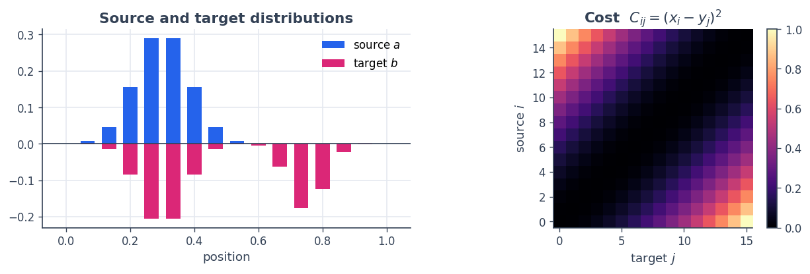
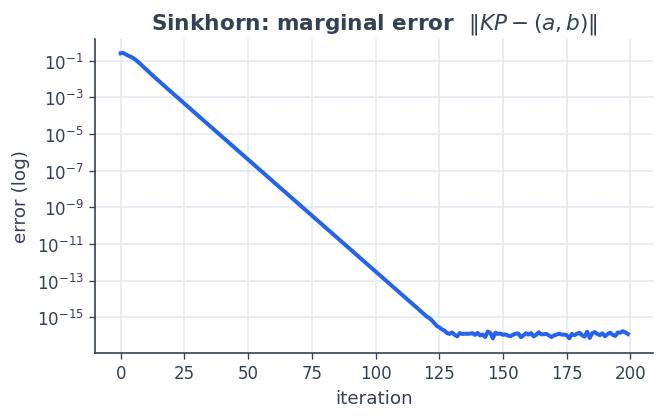
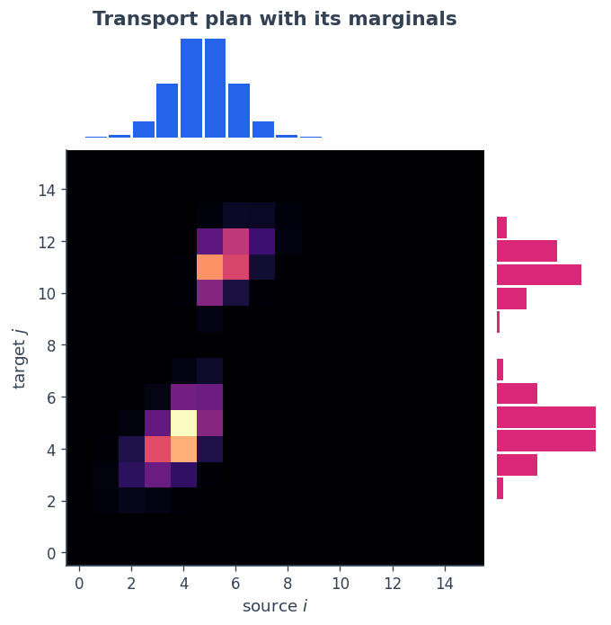
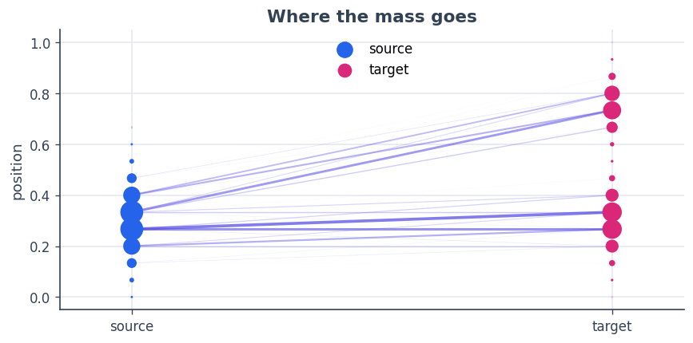

6 · Optimal transport with a matrix-free operator
=================================================

Optimal transport asks how to move mass from a source distribution
:math:`a` to a target :math:`b` at least cost. A **transport plan** is a
nonnegative matrix :math:`P \in \mathbb{R}^{n\times m}` whose row sums
are :math:`a` and column sums are :math:`b`:

.. math::  P\,\mathbf{1} = a, \qquad P^\top \mathbf{1} = b. 

Those two constraints are a single **linear operator** acting on the
plan,

.. math::  K : P \;\longmapsto\; (P\mathbf{1},\; P^\top\mathbf{1}), 

and it would be wasteful to store it as an :math:`(n+m)\times nm`
matrix. This is the perfect job for a **``MatrixFreeLinOp``**: we give
SpaceCore the forward action and its adjoint as two small functions. We
then solve entropic OT with the Sinkhorn algorithm, in which that
operator’s **adjoint** is exactly the step that turns dual potentials
into a transport plan.

**You will learn to** express marginalisation as a matrix-free operator,
verify its adjoint, and use it inside a real algorithm.

.. code:: python

    import numpy as np
    import matplotlib as mpl
    import matplotlib.pyplot as plt
    import spacecore as sc
    
    # A clean, consistent palette + style for every figure in the tutorials.
    BLUE, INDIGO, CYAN = "#2563eb", "#4f46e5", "#0891b2"
    PINK, AMBER, GREEN = "#db2777", "#d97706", "#059669"
    SLATE, GRID = "#334155", "#e5e9f0"
    
    mpl.rcParams.update({
        "figure.figsize": (7.2, 4.2), "figure.dpi": 120, "savefig.dpi": 120,
        "figure.facecolor": "white", "axes.facecolor": "white",
        "axes.edgecolor": SLATE, "axes.linewidth": 1.0,
        "axes.grid": True, "axes.axisbelow": True,
        "grid.color": GRID, "grid.linewidth": 1.0,
        "axes.spines.top": False, "axes.spines.right": False,
        "axes.titlesize": 13, "axes.titleweight": "bold", "axes.titlecolor": SLATE,
        "axes.labelcolor": SLATE, "axes.labelsize": 11,
        "xtick.color": SLATE, "ytick.color": SLATE,
        "xtick.labelsize": 10, "ytick.labelsize": 10, "font.size": 11,
        "legend.frameon": False, "legend.fontsize": 10,
        "lines.linewidth": 2.4, "lines.markersize": 6, "image.cmap": "magma",
    })
    mpl.rcParams["axes.prop_cycle"] = mpl.cycler(
        color=[BLUE, PINK, GREEN, AMBER, INDIGO, CYAN])
    
    print("spacecore", sc.__version__, "| numpy", np.__version__)

.. parsed-literal::

    spacecore 0.4.0 | numpy 2.4.2

.. code:: python

    ctx = sc.Context(sc.NumpyOps(), dtype=np.float64)
    ops = ctx.ops

1 · A source, a target, and a cost
----------------------------------

We place :math:`n` source bins and :math:`m` target bins on the line
:math:`[0,1]`. The source is a single bump, the target is bimodal. The
cost to move a unit of mass from :math:`x_i` to :math:`y_j` is the
squared distance :math:`C_{ij} = (x_i - y_j)^2`.

.. code:: python

    n, m = 16, 16
    xs = np.linspace(0, 1, n)
    ys = np.linspace(0, 1, m)
    
    def normalize(v): return v / v.sum()
    a = normalize(np.exp(-((xs - 0.30) / 0.12) ** 2))                       # source: one bump
    b = normalize(np.exp(-((ys - 0.30) / 0.10) ** 2)
                  + 0.8 * np.exp(-((ys - 0.75) / 0.08) ** 2))               # target: two bumps
    Cmat = (xs[:, None] - ys[None, :]) ** 2                                 # cost matrix
    
    fig, axes = plt.subplots(1, 2, figsize=(10.4, 3.6))
    axes[0].bar(xs, a, width=0.045, color=BLUE, label="source $a$")
    axes[0].bar(ys, -b, width=0.045, color=PINK, label="target $b$")
    axes[0].axhline(0, color=SLATE, lw=1); axes[0].set_title("Source and target distributions")
    axes[0].set_xlabel("position"); axes[0].legend()
    im = axes[1].imshow(Cmat, cmap="magma", origin="lower"); axes[1].grid(False)
    axes[1].set_title("Cost  $C_{ij}=(x_i-y_j)^2$"); axes[1].set_xlabel("target $j$"); axes[1].set_ylabel("source $i$")
    fig.colorbar(im, ax=axes[1], fraction=0.046, pad=0.04); plt.tight_layout(); plt.show()

2 · Marginalisation as a ``MatrixFreeLinOp``
--------------------------------------------

The plan lives in the matrix space :math:`\mathbb{R}^{n\times m}`; the
marginals live in :math:`\mathbb{R}^{n+m}`. The forward map stacks the
row sums and column sums. Its **adjoint** is the “broadcast” map that
takes a vector :math:`(\phi,\psi)` and spreads it back over the matrix
as :math:`\phi_i + \psi_j` — the transpose of summation is tiling.

.. code:: python

    P_space = sc.DenseCoordinateSpace((n, m), ctx)      # transport plans
    M_space = sc.DenseVectorSpace((n + m,), ctx)        # stacked marginals [row; col]
    
    def marginals(P):                                   # forward:  P → (P1, Pᵀ1)
        return ops.concatenate([ops.sum(P, axis=1), ops.sum(P, axis=0)])
    
    def broadcast(g):                                   # adjoint:  (φ, ψ) → φ_i + ψ_j
        return g[:n][:, None] + g[n:][None, :]
    
    K = sc.MatrixFreeLinOp(marginals, broadcast, P_space, M_space, ctx)
    
    # Verify the adjoint identity  <K P, g> = <P, K* g>  (no matrix ever formed)
    rng = np.random.default_rng(0)
    P_test = ctx.asarray(rng.standard_normal((n, m)))
    g_test = ctx.asarray(rng.standard_normal(n + m))
    lhs = float(M_space.inner(K.apply(P_test), g_test))
    rhs = float(P_space.inner(P_test, K.rapply(g_test)))
    print(f"<K P, g> = {lhs:.10f}")
    print(f"<P, K*g> = {rhs:.10f}")
    print("adjoint identity holds:", np.isclose(lhs, rhs))

.. parsed-literal::

    <K P, g> = -1.8810878180
    <P, K*g> = -1.8810878180
    adjoint identity holds: True

3 · Sinkhorn, powered by the adjoint
------------------------------------

Entropic OT solves
:math:`\min_P \langle C, P\rangle + \varepsilon\sum_{ij} P_{ij}\log P_{ij}`
subject to the marginals. Its optimal plan has the form
:math:`P_{ij} = \exp\big((\phi_i + \psi_j - C_{ij})/\varepsilon\big)` —
and :math:`\phi_i+\psi_j` is precisely ``K.rapply([φ, ψ])``. Sinkhorn
alternately rescales rows and columns to hit :math:`a` and :math:`b`. We
track the marginal error with ``K.apply``.

.. code:: python

    eps = 0.01
    kernel = np.exp(-Cmat / eps)
    u, v = np.ones(n), np.ones(m)
    errors = []
    for it in range(200):
        u = a / np.maximum(kernel @ v, 1e-300)
        v = b / np.maximum(kernel.T @ u, 1e-300)
        P = u[:, None] * kernel * v[None, :]
        err = float(M_space.norm(K.apply(ctx.asarray(P)) - ctx.asarray(np.concatenate([a, b]))))
        errors.append(err)
    
    print("final marginal error :", errors[-1])
    print("transport cost <C,P>  :", float(np.sum(Cmat * P)))
    
    # the dual-potential form really does reproduce the plan, via the adjoint
    phi, psi = eps * np.log(u), eps * np.log(v)
    P_dual = np.exp((np.asarray(K.rapply(ctx.asarray(np.concatenate([phi, psi])))) - Cmat) / eps)
    print("plan == exp((K* potentials − C)/ε):", np.allclose(P, P_dual))

.. parsed-literal::

    final marginal error : 1.1943853798950167e-16
    transport cost <C,P>  : 0.05880594096841237
    plan == exp((K* potentials − C)/ε): True

.. code:: python

    fig, ax = plt.subplots(figsize=(6.0, 3.4))
    ax.semilogy(errors, color=BLUE)
    ax.set_title("Sinkhorn: marginal error  $\\|K P - (a,b)\\|$")
    ax.set_xlabel("iteration"); ax.set_ylabel("error (log)"); plt.show()

4 · The transport plan
----------------------

The coupling sits between the two marginals. We display it with the
**source on the horizontal axis and the target on the vertical axis**,
so the source marginal :math:`a` sits on top and the target marginal
:math:`b` runs up the right — each aligned with the axis it belongs to.
Mass flows from the single source bump to *both* target bumps.

.. code:: python

    from matplotlib.gridspec import GridSpec
    fig = plt.figure(figsize=(6.4, 6.4))
    gs = GridSpec(2, 2, width_ratios=[4, 1], height_ratios=[1, 4],
                  wspace=0.05, hspace=0.05)
    ax_top = fig.add_subplot(gs[0, 0]); ax_main = fig.add_subplot(gs[1, 0])
    ax_right = fig.add_subplot(gs[1, 1])
    
    # transpose the plan so the x-axis is the source and the y-axis is the target
    ax_main.imshow(P.T, cmap="magma", origin="lower", aspect="auto"); ax_main.grid(False)
    ax_main.set_xlabel("source $i$"); ax_main.set_ylabel("target $j$")
    ax_top.bar(np.arange(n), a, color=BLUE, width=0.9); ax_top.axis("off")       # source marginal
    ax_top.set_title("Transport plan with its marginals")
    ax_right.barh(np.arange(m), b, color=PINK, height=0.9); ax_right.axis("off") # target marginal
    plt.show()

A second view makes the *movement* explicit: each ribbon connects a
source bin to a target bin, with width proportional to the transported
mass :math:`P_{ij}`.

.. code:: python

    fig, ax = plt.subplots(figsize=(8.4, 3.8))
    Pn = P / P.max()
    for i in range(n):
        for j in range(m):
            if Pn[i, j] > 0.02:
                ax.plot([0, 1], [xs[i], ys[j]], color=INDIGO,
                        alpha=float(min(Pn[i, j], 1.0)) * 0.7, lw=2.2 * Pn[i, j])
    ax.scatter(np.zeros(n), xs, s=900 * a, color=BLUE, zorder=5, label="source")
    ax.scatter(np.ones(m),  ys, s=900 * b, color=PINK, zorder=5, label="target")
    ax.set_xlim(-0.15, 1.15); ax.set_xticks([0, 1]); ax.set_xticklabels(["source", "target"])
    ax.set_ylabel("position"); ax.set_title("Where the mass goes"); ax.legend(loc="upper center")
    plt.show()

Recap
-----

-  The OT marginal constraint is a **linear operator** :math:`K`;
   ``MatrixFreeLinOp(apply, rapply, …)`` captures it with two tiny
   functions and no stored matrix.
-  ``rapply`` must be the **true adjoint** — here the broadcast/tiling
   map — and we checked the identity
   :math:`\langle KP, g\rangle = \langle P, K^\*g\rangle` numerically.
-  That same adjoint is the workhorse inside Sinkhorn: it assembles the
   plan :math:`P=\exp((K^\*[\phi,\psi]-C)/\varepsilon)` from the dual
   potentials.

**Next:** :doc:`7 · Manifold descent <07_manifold_descent>` —
optimisation with a genuinely non-Euclidean geometry.
