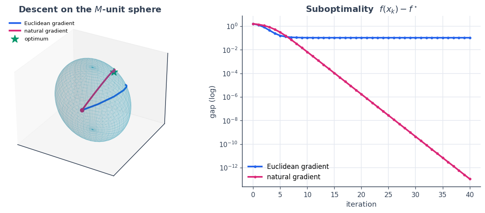

7 · Gradient descent on a manifold with non-Euclidean geometry
==============================================================

Tutorial 3 hinted that the gradient depends on the inner product. Here
we take that idea all the way: we optimise over a **curved manifold**
equipped with a **non-Euclidean metric**, and the right search direction
is the **Riemannian (natural) gradient** — the coordinate gradient with
its index raised by the inverse metric. In SpaceCore that index-raising
is exactly ``space.riesz_inverse``, and the metric is supplied by a
**custom ``InnerProduct``**.

Our manifold is the unit sphere of a metric :math:`M`,

.. math::  \mathcal{S}_M = \{\, x \in \mathbb{R}^3 : \langle x, x\rangle_M = x^\top M x = 1 \,\}, 

(an ellipsoid in ordinary coordinates) and we minimise the linear
objective :math:`f(x) = -\,t^\top x` over it.

**You will learn to** write a custom geometry, build the Riemannian
gradient with ``riesz_inverse``, and run constrained descent with a
projection + retraction.

.. code:: python

    import numpy as np
    import matplotlib as mpl
    import matplotlib.pyplot as plt
    import spacecore as sc
    
    # A clean, consistent palette + style for every figure in the tutorials.
    BLUE, INDIGO, CYAN = "#2563eb", "#4f46e5", "#0891b2"
    PINK, AMBER, GREEN = "#db2777", "#d97706", "#059669"
    SLATE, GRID = "#334155", "#e5e9f0"
    
    mpl.rcParams.update({
        "figure.figsize": (7.2, 4.2), "figure.dpi": 120, "savefig.dpi": 120,
        "figure.facecolor": "white", "axes.facecolor": "white",
        "axes.edgecolor": SLATE, "axes.linewidth": 1.0,
        "axes.grid": True, "axes.axisbelow": True,
        "grid.color": GRID, "grid.linewidth": 1.0,
        "axes.spines.top": False, "axes.spines.right": False,
        "axes.titlesize": 13, "axes.titleweight": "bold", "axes.titlecolor": SLATE,
        "axes.labelcolor": SLATE, "axes.labelsize": 11,
        "xtick.color": SLATE, "ytick.color": SLATE,
        "xtick.labelsize": 10, "ytick.labelsize": 10, "font.size": 11,
        "legend.frameon": False, "legend.fontsize": 10,
        "lines.linewidth": 2.4, "lines.markersize": 6, "image.cmap": "magma",
    })
    mpl.rcParams["axes.prop_cycle"] = mpl.cycler(
        color=[BLUE, PINK, GREEN, AMBER, INDIGO, CYAN])
    
    print("spacecore", sc.__version__, "| numpy", np.__version__)

.. parsed-literal::

    spacecore 0.4.0 | numpy 2.4.2

.. code:: python

    ctx = sc.Context(sc.NumpyOps(), dtype=np.float64)
    ops = ctx.ops

1 · A custom metric is a custom ``InnerProduct``
------------------------------------------------

A geometry implements ``inner`` (and, to be useful for gradients,
``riesz`` / ``riesz_inverse`` — the maps that lower and raise indices).
Here is a constant SPD metric :math:`\langle x,y\rangle = x^\top M y`;
its ``riesz_inverse`` is multiplication by :math:`M^{-1}`, which is what
turns a coordinate gradient into the natural gradient.

.. code:: python

    from spacecore.space import InnerProduct
    
    class MatrixInnerProduct(InnerProduct):
        """Constant SPD metric  <x, y> = xᵀ M y."""
        def __init__(self, M):
            self.M = np.asarray(M, dtype=float)
            self.Minv = np.linalg.inv(self.M)
        def inner(self, ops, x, y):       return ops.vdot(x, ops.matmul(ctx.asarray(self.M), y))
        def riesz(self, ops, x):          return ops.matmul(ctx.asarray(self.M), x)     # lower index
        def riesz_inverse(self, ops, x):  return ops.matmul(ctx.asarray(self.Minv), x)  # raise → nat. grad
        def validate_for(self, space):                                                   # light sanity check
            n = int(np.prod(space.shape))
            if self.M.shape != (n, n):
                raise ValueError(f"metric must be {n}x{n}, got {self.M.shape}")
        def convert(self, ctx):           return self
        @property
        def is_euclidean(self):           return False
    
    M = np.array([[2.0, 0.6, 0.0],
                  [0.6, 1.0, 0.0],
                  [0.0, 0.0, 1.3]])
    Sm = sc.DenseVectorSpace((3,), ctx, geometry=MatrixInnerProduct(M))
    
    x = ctx.asarray([1.0, 0.0, 1.0]); y = ctx.asarray([0.0, 1.0, 1.0])
    print("<x, y>_M           :", float(Sm.inner(x, y)), " (= xᵀ M y)")
    print("riesz_inverse∘riesz:", Sm.riesz_inverse(Sm.riesz(x)), " (round-trips to x)")
    print("is_euclidean       :", Sm.is_euclidean)

.. parsed-literal::

    <x, y>_M           : 1.9  (= xᵀ M y)
    riesz_inverse∘riesz: [1. 0. 1.]  (round-trips to x)
    is_euclidean       : False

2 · Riemannian gradient descent
-------------------------------

One step on the :math:`M`-sphere has three parts:

1. **raise the index** — natural gradient $:raw-latex:`\nabla`\_M f =
   M^{-1}:raw-latex:`\partial `f = $ ``Sm.riesz_inverse(∂f)``;
2. **project onto the tangent space**
   :math:`\{v : \langle x, v\rangle_M = 0\}`, using the :math:`M`-inner
   product;
3. **retract** back onto the manifold by :math:`M`-normalising.

We run it twice: once with the *natural* gradient (``riesz_inverse``),
and once with the raw coordinate gradient (the common bug of forgetting
to raise the index, which is just Euclidean steepest descent). Both
descend, but on different paths.

.. code:: python

    t = ctx.asarray([0.6, 0.9, 0.4])          # objective f(x) = -tᵀx
    f          = lambda x: -float(ops.vdot(t, x))
    coord_grad = lambda x: -t                  # ∂f/∂x  (a covector)
    m_normalize = lambda x: x / float(np.sqrt(Sm.inner(x, x)))
    
    def riemannian_descent(use_natural, eta=0.35, n_steps=40):
        x = m_normalize(ctx.asarray([0.2, -0.9, 0.3]))
        xs, fs = [np.asarray(x).copy()], [f(x)]
        for _ in range(n_steps):
            g = Sm.riesz_inverse(coord_grad(x)) if use_natural else coord_grad(x)
            coef = Sm.inner(x, g) / Sm.inner(x, x)        # tangent projection (M-orthogonal)
            tan = g - coef * x
            x = m_normalize(x - eta * tan)                # gradient step + retraction
            xs.append(np.asarray(x).copy()); fs.append(f(x))
        return np.array(xs), np.array(fs)
    
    path_nat, f_nat = riemannian_descent(use_natural=True)
    path_euc, f_euc = riemannian_descent(use_natural=False)
    
    # closed-form optimum of  max tᵀx  s.t.  xᵀMx = 1
    x_star = np.linalg.solve(M, np.asarray(t)); x_star /= np.sqrt(x_star @ M @ x_star)
    print("natural-grad final f :", f_nat[-1])
    print("Euclidean-grad final f:", f_euc[-1])
    print("optimal f*           :", -float(np.asarray(t) @ x_star))
    print("on manifold? xᵀMx =", float(path_nat[-1] @ M @ path_nat[-1]))

.. parsed-literal::

    natural-grad final f : -0.9670946411949166
    Euclidean-grad final f: -0.861026308213982
    optimal f*           : -0.9670946411950294
    on manifold? xᵀMx = 1.0

3 · See it on the manifold
--------------------------

The :math:`M`-unit sphere is an ellipsoid. We draw it, then trace both
descent paths from the same start to the same optimum (green star). The
natural-gradient route (pink) honours the metric and takes a more direct
path than the metric-blind Euclidean route (blue).

.. code:: python

    # ellipsoid surface: x = M^{-1/2} y for y on the Euclidean unit sphere
    evals, evecs = np.linalg.eigh(M)
    M_half_inv = evecs @ np.diag(evals ** -0.5) @ evecs.T
    uu, vv = np.mgrid[0:np.pi:40j, 0:2*np.pi:40j]
    sph = np.stack([np.sin(uu)*np.cos(vv), np.sin(uu)*np.sin(vv), np.cos(uu)])
    ell = np.einsum("ij,jkl->ikl", M_half_inv, sph)
    
    fig = plt.figure(figsize=(11, 4.6))
    ax = fig.add_subplot(1, 2, 1, projection="3d")
    ax.plot_surface(ell[0], ell[1], ell[2], color=CYAN, alpha=0.12,
                    linewidth=0, antialiased=True)
    ax.plot_wireframe(ell[0], ell[1], ell[2], color=CYAN, alpha=0.18, linewidth=0.4)
    for path, color, lab in [(path_euc, BLUE, "Euclidean gradient"),
                             (path_nat, PINK, "natural gradient")]:
        ax.plot(path[:, 0], path[:, 1], path[:, 2], color=color, lw=2.6, label=lab)
        ax.scatter(*path[0], color=color, s=30)
    ax.scatter(*x_star, color=GREEN, s=140, marker="*", label="optimum")
    ax.set_title("Descent on the $M$-unit sphere"); ax.legend(loc="upper left", fontsize=8)
    ax.set_xticks([]); ax.set_yticks([]); ax.set_zticks([])
    
    ax2 = fig.add_subplot(1, 2, 2)
    opt = -float(np.asarray(t) @ x_star)
    ax2.semilogy(f_euc - opt + 1e-16, color=BLUE, marker="o", ms=3, label="Euclidean gradient")
    ax2.semilogy(f_nat - opt + 1e-16, color=PINK, marker="o", ms=3, label="natural gradient")
    ax2.set_title("Suboptimality  $f(x_k) - f^\\star$"); ax2.set_xlabel("iteration")
    ax2.set_ylabel("gap (log)"); ax2.legend()
    plt.tight_layout(); plt.show()

Both paths stay exactly on the ellipsoid (we checked
:math:`x^\top M x = 1`) and reach the same optimum, but the natural
gradient — built with a single call to ``riesz_inverse`` — gets there in
fewer, straighter steps. The metric is not a detail; it *is* the descent
direction.

   **State-dependent metrics.** A ``Space``\ ’s geometry is fixed, so it
   models a *constant* metric. For a metric that varies with position
   (e.g. Fisher–Rao on the probability simplex, where
   :math:`G(p)=\mathrm{diag}(1/p)`), rebuild a ``WeightedInnerProduct``
   space at each iterate — the natural gradient is still just
   ``riesz_inverse`` of the coordinate gradient.

Recap
-----

-  A non-Euclidean geometry is a **custom ``InnerProduct``**: implement
   ``inner``, ``riesz``, ``riesz_inverse``, ``is_euclidean``, and
   ``validate_for``.
-  The **natural / Riemannian gradient** is
   ``space.riesz_inverse(coordinate_gradient)`` — raising the index with
   the inverse metric.
-  Manifold descent = natural gradient → **tangent projection** →
   **retraction**; the metric shapes both the manifold and the path.

**Next:** :doc:`8 · PDHG for a conic program <08_pdhg_conic_program>`
— operators, cones, and a primal–dual saddle point.
