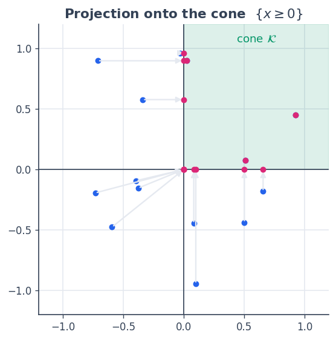
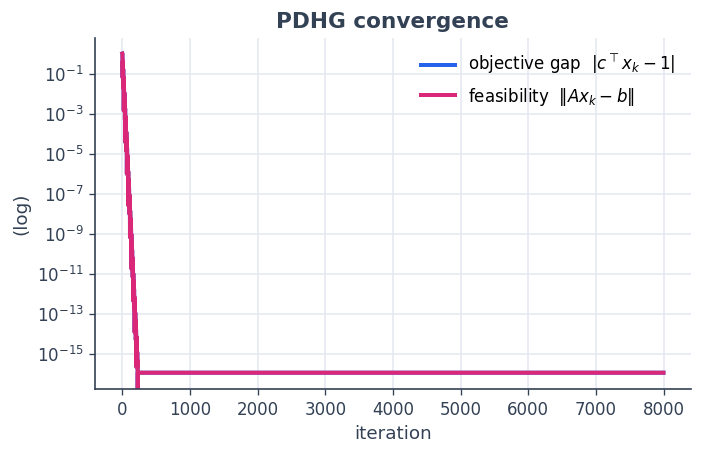
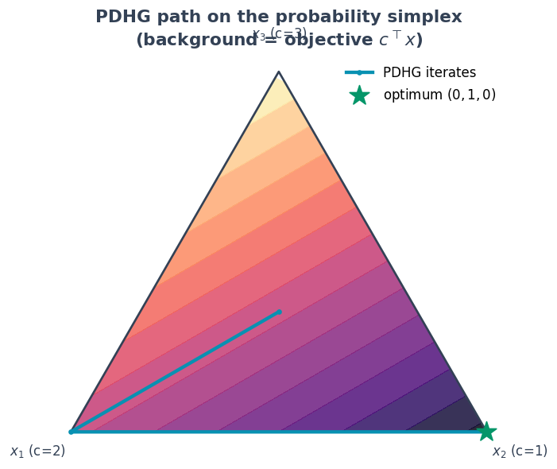

8 · PDHG for a conic program
============================

A huge family of problems are **conic programs**:

.. math::  \min_x \; c^\top x \quad\text{subject to}\quad A x = b,\;\; x \in \mathcal{K}, 

where :math:`\mathcal{K}` is a convex cone — the nonnegative orthant
(LP), the second-order cone (SOCP), or the PSD cone (SDP). The
**Primal–Dual Hybrid Gradient** method (PDHG / Chambolle–Pock) solves
these with three ingredients, each of which SpaceCore provides directly:

-  a linear operator :math:`A` and its **adjoint** — a ``LinOp``;
-  a **projection onto the cone** :math:`\mathcal{K}` — for the orthant,
   the cone of squares of a Jordan-algebra space, projected with
   ``spectral_apply``;
-  a dual update for the equality constraint.

We solve a tiny standard-form LP whose optimum we know, and watch PDHG
walk a primal path across the probability simplex to the answer.

**You will learn to** assemble a saddle-point solver from a SpaceCore
operator and a cone projection, with no dense KKT system.

.. code:: python

    import numpy as np
    import matplotlib as mpl
    import matplotlib.pyplot as plt
    import spacecore as sc
    
    # A clean, consistent palette + style for every figure in the tutorials.
    BLUE, INDIGO, CYAN = "#2563eb", "#4f46e5", "#0891b2"
    PINK, AMBER, GREEN = "#db2777", "#d97706", "#059669"
    SLATE, GRID = "#334155", "#e5e9f0"
    
    mpl.rcParams.update({
        "figure.figsize": (7.2, 4.2), "figure.dpi": 120, "savefig.dpi": 120,
        "figure.facecolor": "white", "axes.facecolor": "white",
        "axes.edgecolor": SLATE, "axes.linewidth": 1.0,
        "axes.grid": True, "axes.axisbelow": True,
        "grid.color": GRID, "grid.linewidth": 1.0,
        "axes.spines.top": False, "axes.spines.right": False,
        "axes.titlesize": 13, "axes.titleweight": "bold", "axes.titlecolor": SLATE,
        "axes.labelcolor": SLATE, "axes.labelsize": 11,
        "xtick.color": SLATE, "ytick.color": SLATE,
        "xtick.labelsize": 10, "ytick.labelsize": 10, "font.size": 11,
        "legend.frameon": False, "legend.fontsize": 10,
        "lines.linewidth": 2.4, "lines.markersize": 6, "image.cmap": "magma",
    })
    mpl.rcParams["axes.prop_cycle"] = mpl.cycler(
        color=[BLUE, PINK, GREEN, AMBER, INDIGO, CYAN])
    
    print("spacecore", sc.__version__, "| numpy", np.__version__)

.. parsed-literal::

    spacecore 0.4.0 | numpy 2.4.2

.. code:: python

    ctx = sc.Context(sc.NumpyOps(), dtype=np.float64)
    ops = ctx.ops

1 · The problem and the cone
----------------------------

.. math::

    \min \; c^\top x \;\;\text{s.t.}\;\; \mathbf{1}^\top x = 1,\;\; x \ge 0,
      \qquad c = (2, 1, 3). 

The feasible set is the probability simplex; since the objective is
linear, the optimum is the cheapest vertex — here
:math:`x^\star = (0,1,0)` with value :math:`1`.

The cone :math:`\mathcal{K} = \mathbb{R}^3_{\ge 0}` is the **cone of
squares** of an ``ElementwiseJordanSpace``. Projection onto it is
:math:`\max(\cdot, 0)`, expressed through the Jordan spectral calculus.

.. code:: python

    A_mat = np.array([[1.0, 1.0, 1.0]])
    b     = ctx.asarray([1.0])
    c     = ctx.asarray([2.0, 1.0, 3.0])
    
    X = sc.ElementwiseJordanSpace((3,), ctx)     # primal lives in the nonnegative orthant
    Y = sc.DenseVectorSpace((1,), ctx)           # multiplier for the equality constraint
    A = sc.DenseLinOp(ctx.asarray(A_mat), X, Y, ctx)
    
    # Projection onto K = {x >= 0}, via the Jordan spectral map  s -> max(s, 0)
    proj_K = lambda x: X.spectral_apply(x, lambda s: ops.maximum(s, 0.0))
    
    demo = ctx.asarray([0.7, -0.4, 0.2])
    print("project (0.7, -0.4, 0.2) onto the orthant:", proj_K(demo))

.. parsed-literal::

    project (0.7, -0.4, 0.2) onto the orthant: [0.7 0.  0.2]

.. code:: python

    # a picture of the cone projection in 2D
    rng = np.random.default_rng(1)
    E2 = sc.ElementwiseJordanSpace((2,), ctx)
    pj2 = lambda v: E2.spectral_apply(v, lambda s: ops.maximum(s, 0.0))
    pts = rng.uniform(-1, 1, size=(14, 2))
    
    fig, ax = plt.subplots(figsize=(5.2, 5.2))
    ax.axhspan(0, 1.2, xmin=0.5, color=GREEN, alpha=0.06)
    ax.fill([0, 1.2, 1.2, 0], [0, 0, 1.2, 1.2], color=GREEN, alpha=0.08)
    for p in pts:
        q = np.asarray(pj2(ctx.asarray(p)))
        ax.annotate("", xy=q, xytext=p, arrowprops=dict(arrowstyle="-|>", color=GRID, lw=1.4))
        ax.scatter(*p, color=BLUE, s=24); ax.scatter(*q, color=PINK, s=24, zorder=5)
    ax.axhline(0, color=SLATE, lw=1); ax.axvline(0, color=SLATE, lw=1)
    ax.set_xlim(-1.2, 1.2); ax.set_ylim(-1.2, 1.2); ax.set_aspect("equal")
    ax.set_title("Projection onto the cone  $\\{x \\geq 0\\}$")
    ax.text(0.6, 1.05, "cone $\\mathcal{K}$", color=GREEN, fontsize=11, ha="center")
    plt.show()

2 · The PDHG iteration
----------------------

PDHG alternates a **primal** step (gradient in :math:`c + A^\top y`,
then project onto :math:`\mathcal{K}`), an over-relaxation, and a
**dual** step (drive :math:`Ax \to b`). The operator’s adjoint
``A.rapply`` supplies :math:`A^\top y`; the cone projection is the
primal proximal step.

.. code:: python

    L = float(np.linalg.norm(A_mat, 2))     # operator norm of A
    tau = sigma = 0.9 / L                     # step sizes:  tau*sigma*L^2 < 1
    
    x = ctx.asarray(np.full(3, 1/3))          # start at the simplex centroid
    y = Y.zeros()
    x_star = np.array([0.0, 1.0, 0.0])
    
    traj, obj_gap, feas = [np.asarray(x).copy()], [], []
    for k in range(8000):
        x_prev = x
        x = proj_K(x - tau * (c + A.rapply(y)))          # primal: step + cone projection
        x_bar = 2.0 * x - x_prev                          # over-relaxation
        y = y + sigma * (A.apply(x_bar) - b)              # dual: enforce Ax = b
        obj_gap.append(abs(float(ops.vdot(c, x)) - 1.0))
        feas.append(float(Y.norm(A.apply(x) - b)))
        if k % 40 == 0:
            traj.append(np.asarray(x).copy())
    traj = np.array(traj)
    
    print("PDHG solution x :", np.round(np.asarray(x), 6))
    print("objective cᵀx   :", float(ops.vdot(c, x)), " (optimum = 1.0)")
    print("feasibility ‖Ax−b‖:", feas[-1])
    print("x ≥ 0 ?          :", bool(np.all(np.asarray(x) >= -1e-12)))

.. parsed-literal::

    PDHG solution x : [0. 1. 0.]
    objective cᵀx   : 0.9999999999999999  (optimum = 1.0)
    feasibility ‖Ax−b‖: 1.1102230246251565e-16
    x ≥ 0 ?          : True

.. code:: python

    fig, ax = plt.subplots(figsize=(6.4, 3.8))
    ax.semilogy(obj_gap, color=BLUE, label="objective gap  $|c^\\top x_k - 1|$")
    ax.semilogy(feas, color=PINK, label="feasibility  $\\|Ax_k - b\\|$")
    ax.set_title("PDHG convergence"); ax.set_xlabel("iteration"); ax.set_ylabel("(log)")
    ax.legend(); plt.show()

3 · The path across the simplex
-------------------------------

Mapping each iterate to barycentric coordinates, we see PDHG start at
the centroid and head to the cheap vertex :math:`x^\star=(0,1,0)`. The
background shades the linear objective :math:`c^\top x` — its straight
level sets confirm the optimum must sit at a corner.

.. code:: python

    import matplotlib.tri as mtri
    corners = np.array([[0.0, 0.0], [1.0, 0.0], [0.5, np.sqrt(3)/2]])   # triangle in 2D
    def bary(x):                                                        # simplex → 2D
        x = np.asarray(x); return x @ corners
    
    # shade the objective over the simplex interior
    s = rng.dirichlet(np.ones(3), size=4000)
    pts2d = s @ corners
    vals = s @ np.asarray(c)
    
    fig, ax = plt.subplots(figsize=(6.2, 5.6))
    tri = mtri.Triangulation(pts2d[:, 0], pts2d[:, 1])
    ax.tricontourf(tri, vals, levels=18, cmap="magma", alpha=0.85)
    ax.plot(*np.vstack([corners, corners[0]]).T, color=SLATE, lw=1.6)
    
    P = bary(traj)
    ax.plot(P[:, 0], P[:, 1], color=CYAN, lw=2.6, marker="o", ms=3, label="PDHG iterates")
    ax.scatter(*bary(x_star), color=GREEN, s=240, marker="*", zorder=6, label="optimum $(0,1,0)$")
    labels = ["$x_1$ (c=2)", "$x_2$ (c=1)", "$x_3$ (c=3)"]
    for corner, lab in zip(corners, labels):
        off = (corner - corners.mean(0)) * 0.16
        ax.text(*(corner + off), lab, ha="center", va="center", fontsize=10, color=SLATE)
    ax.set_aspect("equal"); ax.axis("off"); ax.legend(loc="upper right")
    ax.set_title("PDHG path on the probability simplex\n(background = objective $c^\\top x$)")
    plt.show()

The iterates slide down the objective gradient and park at the
:math:`x_2` corner — the vertex with the smallest cost coefficient —
exactly the LP optimum.

   **Other cones, same loop.** Only the projection changes. For the
   second-order cone use the Lorentz projection; for the PSD cone use
   ``sc.HermitianSpace(n).psd_proj``, which clips the eigenvalues at
   zero. The operator :math:`A`, the adjoint ``A.rapply``, and the PDHG
   skeleton stay identical — which is the point of phrasing the whole
   thing in terms of spaces and operators.

Recap
-----

-  A **conic program** needs a linear operator, its adjoint, and a cone
   projection — PDHG glues them into a primal–dual saddle-point solver.
-  SpaceCore supplies :math:`A` and ``A.rapply`` as a ``LinOp``, and the
   **orthant projection** as the Jordan spectral map
   :math:`\max(\cdot,0)` on an ``ElementwiseJordanSpace``.
-  Swapping the cone (SOC, PSD) swaps only the projection; the operator
   algebra is untouched.

That closes the tutorial path: from
:doc:`contexts <01_backend_and_context>` and
:doc:`spaces <02_linear_algebra>`, through
:doc:`functionals <03_functionals>` and
:doc:`structure <04_tree_spaces>`, to four worked examples — a
:doc:`Tikhonov inverse problem <05_weighted_tikhonov>`, :doc:`optimal transport <06_optimal_transport>`, :doc:`manifold descent <07_manifold_descent>`, and conic optimisation — all
built from the same handful of typed objects.
