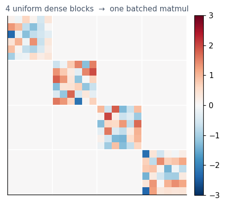

9 · Optimized kernels, dispatch, and operator fusion
====================================================

The first eight tutorials are about *expressing* mathematics. This one
is about the two layers that make that mathematics run fast **without
changing how you write it** — and that both stay out of your way until
you ask for them:

-  **Optimized-kernel dispatch**
   (`ADR-016 <../../docs/dev/adr/016_kernel_layers.md>`__) — route an
   operation to the most efficient *bit-exact* array implementation (one
   batched ``matmul`` instead of a per-block loop, for example). It is
   **off by default**: your results never change, and a fast path is
   taken only when you opt in *and* it is provably equivalent.
-  **Lazy operator algebra and fusion**
   (`ADR-021 <../../docs/dev/adr/021_lazy_operator_algebra_and_simplification.md>`__)
   — simplify an *operator expression* and *multiply operators together
   where possible* (collapse ``A @ B @ C`` of dense operators into one
   matrix). Cheap rewrites happen automatically at construction;
   materializing fusions are an **explicit** ``fuse()`` call.

Neither touches the matrix-free contract: a matrix-free operator is
never silently turned into a dense one.

.. code:: ipython3

    import numpy as np
    import matplotlib as mpl
    import matplotlib.pyplot as plt
    from scipy.linalg import block_diag
    import spacecore as sc
    
    BLUE, INDIGO, CYAN, SLATE = "#2563eb", "#4338ca", "#0891b2", "#475569"
    mpl.rcParams.update({"figure.dpi": 110, "axes.spines.top": False, "axes.spines.right": False})
    
    ctx = sc.Context(sc.NumpyOps(), dtype=np.float64)
    rng = np.random.default_rng(0)

1 · Two kernel layers
---------------------

``spacecore.kernels`` keeps optimization logic out of the operator
classes and splits it in two:

-  **Core kernels** are the check-free bodies of ``apply``/``rapply``/…
   They are bound to each operator *once*, at class-definition time, and
   are **always on the default path** — there is nothing to enable.
-  **Benchmarked specs** are heavier fast paths (a batched ``matmul``
   over uniform dense blocks, an algebraic short-circuit) described by a
   ``KernelSpec``. They are **routed by a single dispatcher**, and
   dispatch is **off by default**.

Let’s build an operator the dispatcher knows a fast path for: a
block-diagonal operator whose blocks are all the same-shape dense
matrices.

.. code:: ipython3

    n, K = 6, 4
    X = sc.DenseCoordinateSpace((n,), ctx)
    block_mats = [rng.standard_normal((n, n)) for _ in range(K)]
    blocks = tuple(sc.DenseLinOp(ctx.asarray(M), X, X, ctx) for M in block_mats)
    
    A = sc.BlockDiagonalLinOp.from_operators(blocks)   # K independent dense blocks
    x = tuple(ctx.asarray(rng.standard_normal(n)) for _ in range(K))   # a tree element is just a tuple
    
    y = A.apply(x)            # the default path (core kernel: a per-block loop)
    print("blocks      :", K, "x", (n, n))
    print("output parts:", [tuple(np.asarray(yi).shape) for yi in y])

.. parsed-literal::

    blocks      : 4 x (6, 6)
    output parts: [(6,), (6,), (6,), (6,)]

Turning dispatch on
~~~~~~~~~~~~~~~~~~~

The dispatcher has three modes, set process-globally or — better — for
an enclosing scope with the ``dispatch_mode`` context manager:

-  ``"off"`` (default) — always run the plain inline path.
-  ``"on"`` — route to the applicable optimized spec (here: stack the
   blocks and issue **one** batched ``matmul`` instead of ``K``).
-  ``"verify"`` — run *both* the optimized and the inline path and
   assert they agree bit-for-bit, raising on any mismatch. This is the
   safety net you run in tests/CI before trusting a key.

Because every auto-routable spec is required to be **exactly**
equivalent (``rtol == atol == 0``), ``"on"`` is bit-identical to
``"off"`` — it is faster, not different.

.. code:: ipython3

    from spacecore.kernels import dispatch_mode
    
    y_off = A.apply(x)                       # default
    with dispatch_mode("on"):
        y_on = A.apply(x)                    # routed to the batched-matmul spec
    with dispatch_mode("verify"):
        y_ver = A.apply(x)                   # runs both, asserts agreement
    
    exact = all(np.array_equal(np.asarray(a), np.asarray(b)) for a, b in zip(y_off, y_on))
    print("on  is bit-exact to off :", exact)
    print("verify mode agreed      :", y_ver is not None)

.. parsed-literal::

    on  is bit-exact to off : True
    verify mode agreed      : True

Why off by default — the rails
~~~~~~~~~~~~~~~~~~~~~~~~~~~~~~

Routing to a fast path is only safe behind a set of rails, all enforced
by the ``KernelSpec`` contract:

-  **Exactness** — only specs with ``rtol == atol == 0`` are
   auto-routed.
-  **A memory gate** — a *materializing* fast path (one that allocates
   extra, like stacking ``K`` block matrices) carries a shape-only cost
   estimate, and the dispatcher selects it only when that estimate fits
   the backend’s free-memory budget. *No estimate, no fuse; no budget,
   no fuse.*
-  **Matrix-free safety** — a matrix-free operator is never silently
   materialized.

Each operation family the dispatcher knows about is a **dispatch key**;
many specs can register under one key, and the dispatcher picks the
highest-priority applicable one. Here is the live catalog:

.. code:: ipython3

    from spacecore.kernels import registry
    
    for key in sorted(registry.dispatch_keys()):
        names = [s.name for s in registry.dispatch_candidates(key)]
        print(f"{key:34s} -> {', '.join(names)}")

.. parsed-literal::

    linop.block_diagonal.apply         -> block-diagonal-uniform-dense-batched
    linop.block_diagonal.rapply        -> block-diagonal-uniform-dense-batched-rapply
    linop.block_diagonal.rvapply       -> block-diagonal-uniform-dense-batched-rvapply
    linop.block_diagonal.vapply        -> block-diagonal-uniform-dense-batched-vapply
    linop.composed.apply               -> composed-zero-annihilation, composed-identity-elision
    linop.stacked.apply                -> stacked-uniform-dense-batched-apply
    linop.sum_to_single.rapply         -> sum-to-single-uniform-dense-batched-rapply

The block-diagonal heatmap below is the structure the fast path
exploits: ``K`` independent dense blocks on the diagonal, all the same
shape, are exactly the case a single batched ``matmul`` handles in one
backend call.

.. code:: ipython3

    dense_blockdiag = block_diag(*block_mats)
    fig, ax = plt.subplots(figsize=(4.2, 4.2))
    im = ax.imshow(dense_blockdiag, cmap="RdBu_r", vmin=-3, vmax=3)
    ax.set_title(f"{K} uniform dense blocks  →  one batched matmul", fontsize=10, color=SLATE)
    for i in range(1, K):
        ax.axhline(i * n - 0.5, color="white", lw=1.2)
        ax.axvline(i * n - 0.5, color="white", lw=1.2)
    ax.set_xticks([]); ax.set_yticks([])
    fig.colorbar(im, ax=ax, fraction=0.046, pad=0.04)
    plt.tight_layout(); plt.show()

2 · Lazy operator algebra and ``fuse()``
----------------------------------------

Operator expressions are **lazy**: ``A @ B``, ``A + B``, ``c * A``,
``A.H`` build a small tree, evaluating nothing until you apply it.
Simplification has two tiers.

**Tier 1 — automatic, at construction.** Cheap, local rewrites happen
the moment you build the expression: an identity factor disappears, a
zero map collapses the product, nested scalars fold. These cost nothing
and are always applied.

.. code:: ipython3

    M1 = sc.DenseLinOp(ctx.asarray(rng.standard_normal((n, n))), X, X, ctx)
    I  = sc.IdentityLinOp(X, ctx)
    
    print("M1 @ I  is  M1 :", (M1 @ I) is M1)          # identity elided at construction
    print("type of 2*(3*M1):", type(2.0 * (3.0 * M1)).__name__,
          "-> one ScaledLinOp with scalar", (2.0 * (3.0 * M1)).scalar)

.. parsed-literal::

    M1 @ I  is  M1 : True
    type of 2*(3*M1): ScaledLinOp -> one ScaledLinOp with scalar 6.0

**Tier 2 — explicit, with ``fuse()``.** *Multiplying operators together*
is a materializing rewrite, so it is something you ask for. ``fuse()``
collapses each maximal run of dense operators into a single
``DenseLinOp`` holding the matrix product — the whole chain becomes one
matrix.

Fusing reassociates the arithmetic (a matrix product, then apply,
differs at the last bit from applying in sequence), so the result is
equal **up to rounding**, not bit-for-bit. It is adjoint-consistent on
any geometry — including non-Euclidean — because the shared middle-space
Riesz maps cancel.

.. code:: ipython3

    M2 = sc.DenseLinOp(ctx.asarray(rng.standard_normal((n, n))), X, X, ctx)
    M3 = sc.DenseLinOp(ctx.asarray(rng.standard_normal((n, n))), X, X, ctx)
    
    expr  = M1 @ M2 @ M3                 # a lazy composition tree
    fused = expr.fuse()                  # one DenseLinOp: M1 @ M2 @ M3 as a single matrix
    
    xv = ctx.asarray(rng.standard_normal(n))
    print("before fuse :", type(expr).__name__)
    print("after  fuse :", type(fused).__name__)
    print("same action :", np.allclose(np.asarray(fused.apply(xv)), np.asarray(expr.apply(xv))))

.. parsed-literal::

    before fuse : ComposedLinOp
    after  fuse : DenseLinOp
    same action : True

The matrix-free rail
~~~~~~~~~~~~~~~~~~~~

``fuse()`` only multiplies operators that already hold a cheap matrix. A
**matrix-free** operator — defined by callables, with no stored matrix —
is left untouched: it stays a lazy leaf and simply breaks the fusible
run, so its matrix-free contract is preserved.

If you genuinely want to densify a matrix-free operand — accepting the
cost and giving up the matrix-free property — that is an **explicit
opt-in**: ``fuse(materialize=True)``.

.. code:: ipython3

    Mf = sc.MatrixFreeLinOp(lambda v: 2.0 * v, lambda v: 2.0 * v, X, X, ctx)  # matrix-free
    
    print("(M1 @ Mf).fuse()                 ->", type((M1 @ Mf).fuse()).__name__,
          " (matrix-free kept lazy)")
    print("(M1 @ Mf).fuse(materialize=True) ->", type((M1 @ Mf).fuse(materialize=True)).__name__,
          " (explicitly densified)")

.. parsed-literal::

    (M1 @ Mf).fuse()                 -> ComposedLinOp  (matrix-free kept lazy)
    (M1 @ Mf).fuse(materialize=True) -> DenseLinOp  (explicitly densified)

3 · How the two layers compose
------------------------------

Fusion changes *what an operator is*; dispatch reads that structure the
next time you apply. So they cooperate: fusing a block whose definition
was a composition of dense operators turns it into a single dense block
— which then makes the enclosing block-diagonal operator eligible for
the batched-``matmul`` fast path.

.. code:: ipython3

    # A block-diagonal whose blocks are themselves compositions of dense operators.
    composed_blocks = tuple(
        sc.DenseLinOp(ctx.asarray(rng.standard_normal((n, n))), X, X, ctx)
        @ sc.DenseLinOp(ctx.asarray(rng.standard_normal((n, n))), X, X, ctx)
        for _ in range(K)
    )
    B = sc.BlockDiagonalLinOp.from_operators(composed_blocks)
    B_fused = B.fuse()                  # each block collapses to one DenseLinOp
    
    print("block type before fuse:", type(B.parts[0]).__name__)
    print("block type after  fuse:", type(B_fused.parts[0]).__name__,
          "(now foldable by the block-diagonal dispatch spec)")
    print("same action           :",
          all(np.allclose(np.asarray(a), np.asarray(b))
              for a, b in zip(B.apply(x), B_fused.apply(x))))

.. parsed-literal::

    block type before fuse: ComposedLinOp
    block type after  fuse: DenseLinOp (now foldable by the block-diagonal dispatch spec)
    same action           : True

Takeaways
---------

-  **Dispatch (ADR-016)** picks the fastest *bit-exact* array kernel for
   an operation. It is **off by default**, gated by exactness and a
   memory budget, and never materializes a matrix-free operand. Turn it
   on with ``dispatch_mode("on")`` and prove it with
   ``dispatch_mode("verify")``.
-  **Fusion (ADR-021)** simplifies the *operator expression*. Cheap
   identities fold automatically at construction; ``fuse()`` multiplies
   dense operators into one matrix (equal up to rounding,
   adjoint-consistent on any geometry). It never densifies a matrix-free
   operand unless you pass ``materialize=True``.
-  The two **compose**: ``fuse()`` produces operators that dispatch can
   then accelerate.

Both are opt-in by design — the default path always gives you the plain,
predictable result, and the fast paths are there when you ask and only
when they’re provably equivalent.
