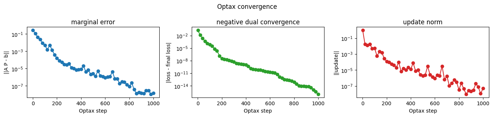
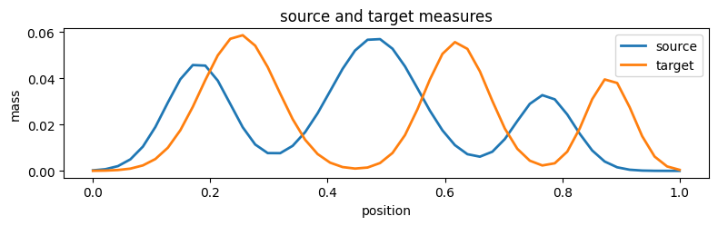
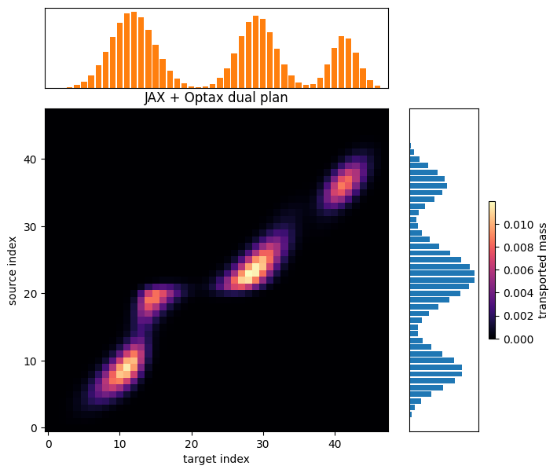

Example: Regularized optimal transport
======================================

Status
   Retained advanced example.
Release gate
   Not part of the 0.3.1 release-candidate gate. The active release-gate
   notebook set is listed in :doc:`index` and executed by
   ``scripts/verify_release_candidate.sh``.
Optional dependencies
   JAX, Optax, and Matplotlib.

Optimal transport asks how to move mass from a source distribution to a
target distribution with minimal total cost. In the discrete setting,
the source marginal is :math:`a \in \mathbb{R}^m_+`, the target marginal
is :math:`b \in \mathbb{R}^n_+`, and a transport plan is a nonnegative
matrix :math:`P \in \mathbb{R}^{m \times n}_+` whose rows sum to
:math:`a` and columns sum to :math:`b`:

.. math::

   P \mathbf{1}_n = a, \qquad P^\top \mathbf{1}_m = b.

With cost matrix :math:`C`, the unregularized problem is

.. math::

   \min_{P \ge 0} \; \langle C, P \rangle
   \quad \text{subject to} \quad
   P \mathbf{1}_n = a, \; P^\top \mathbf{1}_m = b.

This notebook uses the entropy-regularized version,

.. math::

   \min_{P \ge 0}
   \langle C, P \rangle
   + \varepsilon \sum_{i,j} P_{ij}(\log P_{ij} - 1)
   \quad \text{subject to the same marginal constraints.}

The main goal is not to introduce the fastest OT solver. It is to show
how SpaceCore lets us write the mathematical objects once, then reuse
the same problem definition across backends: NumPy for a reference
Sinkhorn solve, and JAX/Optax for a differentiable dual optimization
loop.

.. code:: python

    import numpy as np
    import matplotlib.pyplot as plt
    import optax
    
    from spacecore.backend import Context, JaxOps, NumpyOps
    from spacecore.space import DenseCoordinateSpace, DenseVectorSpace
    from spacecore.linop import MatrixFreeLinOp

Encoding the mathematics once
-----------------------------

The marginal constraints can be written as one linear equation

.. math::

   A(P) = \begin{bmatrix} P \mathbf{1}_n \\ P^\top \mathbf{1}_m \end{bmatrix}
   = \begin{bmatrix} a \\ b \end{bmatrix}.

``make_marginal_linop`` builds this operator :math:`A` with ``MatrixFreeLinOp``. Its forward pass computes
row and column sums. Its adjoint :math:`A^*` takes marginal dual
variables and broadcasts them back to a matrix-shaped object, so each
entry :math:`(i, j)` receives the source potential for row :math:`i` and
the target potential for column :math:`j`.

The regularized dual for a marginal dual vector :math:`\lambda` is

.. math::

   \max_{\lambda} \;
   \langle \lambda, [a, b] \rangle
   - \varepsilon \sum_{i,j}
   \exp\left(\frac{(A^*\lambda)_{ij} - C_{ij}}{\varepsilon}\right).

That formula is why the problem class exposes both ``dual_objective``
and ``plan_from_dual``. The optimizer only sees a vector of dual
variables, while the transport plan is reconstructed through

.. math::

   P(\lambda)_{ij}
   = \exp\left(\frac{(A^*\lambda)_{ij} - C_{ij}}{\varepsilon}\right).

Because the operator, arrays, and spaces all carry a ``Context``, the
same implementation can be converted from NumPy to JAX without rewriting
these formulas.

.. code:: python

    def make_marginal_linop(plan_space, *, ctx=None):
        # The variable of the OT problem is a matrix P with shape (m, n).
        # Row i stores mass sent out of source bin i; column j stores mass
        # received by target bin j.
        m, n = plan_space.shape
        resolved_ctx = plan_space.ctx if ctx is None else ctx

        # A(P) contains all equality constraints in one vector:
        #     [row sums of P, column sums of P].
        marginal_space = DenseVectorSpace((m + n,), ctx=resolved_ctx)
        ops = resolved_ctx.ops

        def apply(plan):
            # Forward map A(P): transport plan -> achieved marginals.
            row_sums = ops.sum(plan, axis=1)
            column_sums = ops.sum(plan, axis=0)
            return ops.concatenate([row_sums, column_sums])

        def rapply(marginal_dual):
            # Adjoint map A^*(lambda): marginal potentials -> plan-shaped scores.
            # The first m entries price source constraints; the last n entries
            # price target constraints. Each transport entry P[i, j] sees both.
            row_dual = marginal_dual[:m]
            column_dual = marginal_dual[m:]
            return row_dual[:, None] + column_dual[None, :]

        return MatrixFreeLinOp(apply, rapply, plan_space, marginal_space, ctx=resolved_ctx)

    class RegularizedOTProblem:
        def __init__(self, source, target, cost, epsilon, *, ctx):
            self.ctx = ctx
            self.ops = ctx.ops
            self.source = ctx.asarray(source)
            self.target = ctx.asarray(target)
            self.cost = ctx.asarray(cost)
            self.epsilon = epsilon
            self.m, self.n = self.cost.shape
    
            # Keep shape checks close to construction so later solver code can be
            # short and can assume the source, target, and cost are compatible.
            if self.source.shape != (self.m,):
                raise ValueError('source must match the number of cost rows')
            if self.target.shape != (self.n,):
                raise ValueError('target must match the number of cost columns')
    
            self.plan_space = DenseCoordinateSpace((self.m, self.n), ctx=ctx)
            self.marginal_op = make_marginal_linop(self.plan_space, ctx=ctx)
            self.marginal_target = self.ops.concatenate([self.source, self.target])
    
        def convert(self, new_ctx):
            return RegularizedOTProblem(
                new_ctx.asarray(self.source),
                new_ctx.asarray(self.target),
                new_ctx.asarray(self.cost),
                self.epsilon,
                ctx=new_ctx,
            )
    
        def primal_objective(self, plan):
            # Entropy-regularized primal objective:
            #     <C, P> + eps * sum(P * (log(P) - 1)).
            # The max only protects diagnostics from log(0); the optimized plans are
            # positive because they are exponentials of dual scores.
            positive_plan = self.ops.maximum(plan, 1e-300)
            transport_cost = self.ops.vdot(self.cost, plan)
            entropy = self.ops.sum(positive_plan * (self.ops.log(positive_plan) - 1.0))
            return transport_cost + self.epsilon * entropy
    
        def objective(self, plan):
            return self.primal_objective(plan)
    
        def marginal_error_norm(self, plan):
            # This is the feasibility residual ||A(P) - b||_2.
            error = self.marginal_op.apply(plan) - self.marginal_target
            return self.ops.sqrt(self.ops.sum(self.ops.abs(error) ** 2))
    
        def plan_from_dual(self, marginal_dual):
            # For entropy-regularized OT, maximizing over P for a fixed dual lambda
            # has the closed form P(lambda) = exp((A^* lambda - C) / epsilon).
            dual_on_plan = self.marginal_op.rapply(marginal_dual)
            logits = (dual_on_plan - self.cost) / self.epsilon
            return self.ops.exp(logits)
    
        def dual_objective(self, marginal_dual):
            # Dual objective:
            #     <lambda, b> - eps * sum(exp((A^* lambda - C) / eps)).
            # There is no extra normalization dual variable here; lambda already
            # contains the row and column marginal potentials.
            plan = self.plan_from_dual(marginal_dual)
            linear_term = self.ops.vdot(marginal_dual, self.marginal_target)
            conjugate_term = self.epsilon * self.ops.sum(plan)
            return linear_term - conjugate_term
    
        def negative_dual_objective(self, marginal_dual):
            # Optax minimizers expect a loss, so we minimize the negative dual.
            return -self.dual_objective(marginal_dual)
    
    
    def gaussian_mixture_1d(ctx, grid, centers, scales, weights):
        ops = ctx.ops
        density = ops.zeros(grid.shape, dtype=ctx.dtype)
        for center, scale, weight in zip(centers, scales, weights):
            z = (grid - center) / scale
            density = density + weight * ops.exp(-0.5 * z * z)
        return density / ops.sum(density)
    
    
    def squared_distance_cost(source_grid, target_grid):
        displacement = source_grid[:, None] - target_grid[None, :]
        return displacement * displacement
    
    
    def to_numpy(array):
        return np.asarray(JaxOps.jax.device_get(array))

A small discrete transport problem
----------------------------------

We build two smooth one-dimensional probability distributions on grids
of the same size. Keeping the source and target marginals the same
length is not required by OT, but it removes shape distractions and
keeps attention on the operator-based formulation.

.. code:: python

    np_ctx = Context(NumpyOps(), dtype='float64', enable_checks=True)
    np_ops = np_ctx.ops
    
    num_points = 48
    source_grid = np_ops.arange(num_points, dtype=np_ctx.dtype) / (num_points - 1)
    target_grid = np_ops.arange(num_points, dtype=np_ctx.dtype) / (num_points - 1)
    
    source = gaussian_mixture_1d(
        np_ctx,
        source_grid,
        centers=(0.18, 0.48, 0.77),
        scales=(0.055, 0.075, 0.050),
        weights=(0.34, 0.42, 0.24),
    )
    target = gaussian_mixture_1d(
        np_ctx,
        target_grid,
        centers=(0.25, 0.62, 0.88),
        scales=(0.065, 0.055, 0.040),
        weights=(0.38, 0.36, 0.26),
    )
    cost = squared_distance_cost(source_grid, target_grid)
    epsilon = 0.004
    
    problem_np = RegularizedOTProblem(source, target, cost, epsilon, ctx=np_ctx)
    
    print('source mass:', np_ops.sum(problem_np.source))
    print('target mass:', np_ops.sum(problem_np.target))
    print('plan shape:', problem_np.plan_space.shape)
    print('marginal vector shape:', problem_np.marginal_op.cod.shape)

.. parsed-literal::

    source mass: 1.0000000000000002
    target mass: 0.9999999999999999
    plan shape: (48, 48)
    marginal vector shape: (96,)

A NumPy reference solve
-----------------------

First we solve the regularized primal problem in the NumPy backend with
Sinkhorn scaling. This gives a reliable reference transport plan and
also checks that the data, cost, and marginal operator agree before
moving to a different backend.

.. code:: python

    def solve_sinkhorn(problem, *, max_iter=20_000, tolerance=1e-12):
        ops = problem.ops
        kernel = ops.exp(-problem.cost / problem.epsilon)
        left = ops.ones((problem.m,), dtype=problem.ctx.dtype)
        right = ops.ones((problem.n,), dtype=problem.ctx.dtype)
        tiny = 1e-300
    
        for iteration in range(max_iter):
            # Alternating row and column rescaling enforces the two marginals.
            left = problem.source / ops.maximum(ops.matmul(kernel, right), tiny)
            right = problem.target / ops.maximum(ops.matmul(ops.transpose(kernel), left), tiny)
    
            if iteration % 100 == 0 or iteration == max_iter - 1:
                plan = left[:, None] * kernel * right[None, :]
                if float(problem.marginal_error_norm(plan)) < tolerance:
                    return plan, iteration + 1
    
        return left[:, None] * kernel * right[None, :], max_iter
    
    
    plan_np, sinkhorn_iterations = solve_sinkhorn(problem_np)
    
    print('sinkhorn iterations:', sinkhorn_iterations)
    print('numpy primal objective:', problem_np.objective(plan_np))
    print('numpy marginal error:', problem_np.marginal_error_norm(plan_np))

.. parsed-literal::

    sinkhorn iterations: 1001
    numpy primal objective: -0.016892120788907505
    numpy marginal error: 9.493478748528548e-14

Reusing the same problem in JAX
-------------------------------

Now the already-defined ``RegularizedOTProblem`` is converted to a JAX
context. The mathematical object is the same: same source and target
marginals, same cost, same marginal operator, and same dual objective.
What changes is the backend that owns the arrays and executes the
numerical work.

Optax minimizes the negative regularized dual. The Python loop stays
explicit so the optimization is easy to read, but the update step is
JIT-compiled: each compiled call evaluates the dual loss and gradient,
applies the L-BFGS update, reconstructs the current plan, and returns
scalar diagnostics.

The dual potentials have a constant-shift invariance between row and
column potentials. We leave that invariance alone here; no extra
normalization dual variable or penalty is needed for the notebook’s
purpose.

.. code:: python

    import jax
    jax.config.update('jax_enable_x64', True)
    
    # Checks are useful while constructing the NumPy problem above. For JIT-traced
    # JAX values, Python-side membership checks can see tracers instead of concrete
    # arrays, so the solver context disables them after the data has been validated.
    jax_ctx = Context(JaxOps(), dtype='float64', enable_checks=False)
    problem_jax = problem_np.convert(jax_ctx)
    
    
    def solve_with_optax(problem, *, steps=1000, log_every=20):
        if problem.ops.family != 'jax':
            raise TypeError('Optax solve requires a JAX context.')
    
        optimizer = optax.lbfgs()
        potentials = problem.marginal_op.cod.zeros()
        opt_state = optimizer.init(potentials)
    
        def loss_fn(current_potentials):
            # Keep the loss as the negative dual so the mathematical objective stays
            # in RegularizedOTProblem and the optimizer code remains generic.
            return problem.negative_dual_objective(current_potentials)
    
        value_and_grad = optax.value_and_grad_from_state(loss_fn)
    
        @jax.jit
        def optax_step(current_potentials, current_opt_state):
            # This whole function is compiled: loss/grad, L-BFGS update, plan
            # reconstruction, and the scalar diagnostics used by the outer loop.
            loss, grads = value_and_grad(current_potentials, state=current_opt_state)
            updates, next_opt_state = optimizer.update(
                grads,
                current_opt_state,
                current_potentials,
                value=loss,
                grad=grads,
                value_fn=loss_fn,
            )
            next_potentials = optax.apply_updates(current_potentials, updates)
    
            # Diagnostics are computed from the updated potentials so the printed
            # values match the plan returned at the end of the solve.
            next_loss = loss_fn(next_potentials)
            plan = problem.plan_from_dual(next_potentials)
            primal = problem.objective(plan)
            marginal_error = problem.marginal_error_norm(plan)
            update_norm = problem.ops.sqrt(problem.ops.sum(problem.ops.abs(updates) ** 2))
            return next_potentials, next_opt_state, next_loss, primal, marginal_error, update_norm
    
        history = {
            'step': [],
            'negative_dual': [],
            'primal_objective': [],
            'marginal_error': [],
            'update_norm': [],
        }
    
        for step in range(1, steps + 1):
            potentials, opt_state, loss, primal, marginal_error, update_norm = optax_step(
                potentials,
                opt_state,
            )
    
            # Only transfer scalars back to NumPy when we want to print or plot.
            # Keeping all per-step arrays on device avoids unnecessary host traffic.
            if step == 1 or step % log_every == 0 or step == steps:
                history['step'].append(step)
                history['negative_dual'].append(float(to_numpy(loss)))
                history['primal_objective'].append(float(to_numpy(primal)))
                history['marginal_error'].append(float(to_numpy(marginal_error)))
                history['update_norm'].append(float(to_numpy(update_norm)))
    
                print(
                    f'step {step:03d} | '
                    f'negative dual {history["negative_dual"][-1]:.8e} | '
                    f'primal {history["primal_objective"][-1]:.8e} | '
                    f'marginal error {history["marginal_error"][-1]:.3e} | '
                    f'update norm {history["update_norm"][-1]:.3e}'
                )
    
        plan = problem.plan_from_dual(potentials)
        return plan, potentials, history
    
    
    plan_jax, potentials_jax, optax_history = solve_with_optax(problem_jax)
    
    print('jax primal objective:', problem_jax.objective(plan_jax))
    print('jax dual objective:', problem_jax.dual_objective(potentials_jax))
    print('jax marginal error:', problem_jax.marginal_error_norm(plan_jax))

.. parsed-literal::

    step 001 | negative dual 2.09400055e-01 | primal -6.00152394e-15 | marginal error 2.709e-01 | update norm 1.000e+00

.. parsed-literal::

    step 020 | negative dual 3.01528807e-02 | primal -1.20494339e-02 | marginal error 1.136e-01 | update norm 1.804e-02
    step 040 | negative dual 1.91029940e-02 | primal -1.83400852e-02 | marginal error 4.261e-02 | update norm 1.237e-02
    step 060 | negative dual 1.73691929e-02 | primal -1.70707765e-02 | marginal error 2.423e-02 | update norm 1.839e-02
    step 080 | negative dual 1.70318398e-02 | primal -1.68139182e-02 | marginal error 9.192e-03 | update norm 5.196e-03
    step 100 | negative dual 1.69648575e-02 | primal -1.68757775e-02 | marginal error 4.805e-03 | update norm 5.553e-03
    step 120 | negative dual 1.69217542e-02 | primal -1.69530699e-02 | marginal error 1.525e-03 | update norm 5.679e-04
    step 140 | negative dual 1.68981588e-02 | primal -1.69808451e-02 | marginal error 5.088e-03 | update norm 2.184e-03
    step 160 | negative dual 1.68946428e-02 | primal -1.68763106e-02 | marginal error 1.386e-03 | update norm 1.606e-03
    step 180 | negative dual 1.68922726e-02 | primal -1.69054794e-02 | marginal error 3.919e-04 | update norm 2.829e-04
    step 200 | negative dual 1.68921573e-02 | primal -1.68943993e-02 | marginal error 1.635e-04 | update norm 1.154e-04
    step 220 | negative dual 1.68921422e-02 | primal -1.68931419e-02 | marginal error 8.191e-05 | update norm 9.359e-05
    step 240 | negative dual 1.68921384e-02 | primal -1.68940873e-02 | marginal error 5.585e-05 | update norm 5.961e-05
    step 260 | negative dual 1.68921321e-02 | primal -1.68919586e-02 | marginal error 3.031e-05 | update norm 4.280e-05
    step 280 | negative dual 1.68921296e-02 | primal -1.68909106e-02 | marginal error 2.687e-05 | update norm 2.056e-05
    step 300 | negative dual 1.68921263e-02 | primal -1.68906969e-02 | marginal error 3.876e-05 | update norm 9.891e-05
    step 320 | negative dual 1.68921232e-02 | primal -1.68922909e-02 | marginal error 1.270e-05 | update norm 6.897e-06
    step 340 | negative dual 1.68921226e-02 | primal -1.68914601e-02 | marginal error 1.014e-05 | update norm 1.643e-05
    step 360 | negative dual 1.68921223e-02 | primal -1.68920029e-02 | marginal error 6.832e-06 | update norm 1.093e-05
    step 380 | negative dual 1.68921220e-02 | primal -1.68924465e-02 | marginal error 8.067e-06 | update norm 2.202e-05
    step 400 | negative dual 1.68921218e-02 | primal -1.68922159e-02 | marginal error 8.252e-06 | update norm 1.249e-05
    step 420 | negative dual 1.68921213e-02 | primal -1.68918600e-02 | marginal error 2.005e-05 | update norm 7.998e-05
    step 440 | negative dual 1.68921209e-02 | primal -1.68923326e-02 | marginal error 4.242e-06 | update norm 7.727e-06
    step 460 | negative dual 1.68921209e-02 | primal -1.68921417e-02 | marginal error 7.152e-06 | update norm 1.044e-05
    step 480 | negative dual 1.68921209e-02 | primal -1.68922191e-02 | marginal error 2.081e-06 | update norm 2.528e-06
    step 500 | negative dual 1.68921209e-02 | primal -1.68921811e-02 | marginal error 2.611e-06 | update norm 1.927e-06
    step 520 | negative dual 1.68921208e-02 | primal -1.68920319e-02 | marginal error 1.330e-06 | update norm 2.390e-06
    step 540 | negative dual 1.68921208e-02 | primal -1.68921889e-02 | marginal error 5.387e-06 | update norm 3.017e-05
    step 560 | negative dual 1.68921208e-02 | primal -1.68921184e-02 | marginal error 1.454e-06 | update norm 2.664e-06
    step 580 | negative dual 1.68921208e-02 | primal -1.68920934e-02 | marginal error 1.159e-06 | update norm 1.446e-06
    step 600 | negative dual 1.68921208e-02 | primal -1.68921510e-02 | marginal error 8.934e-07 | update norm 9.320e-07
    step 620 | negative dual 1.68921208e-02 | primal -1.68921214e-02 | marginal error 1.108e-06 | update norm 2.411e-06
    step 640 | negative dual 1.68921208e-02 | primal -1.68920007e-02 | marginal error 1.159e-06 | update norm 1.943e-06
    step 660 | negative dual 1.68921208e-02 | primal -1.68921298e-02 | marginal error 4.491e-06 | update norm 3.163e-05
    step 680 | negative dual 1.68921208e-02 | primal -1.68921470e-02 | marginal error 6.782e-07 | update norm 6.352e-07
    step 700 | negative dual 1.68921208e-02 | primal -1.68921450e-02 | marginal error 6.970e-07 | update norm 1.773e-06
    step 720 | negative dual 1.68921208e-02 | primal -1.68921343e-02 | marginal error 1.892e-07 | update norm 1.133e-07
    step 740 | negative dual 1.68921208e-02 | primal -1.68921174e-02 | marginal error 2.955e-07 | update norm 2.211e-07
    step 760 | negative dual 1.68921208e-02 | primal -1.68921265e-02 | marginal error 2.800e-07 | update norm 5.827e-07
    step 780 | negative dual 1.68921208e-02 | primal -1.68921201e-02 | marginal error 1.430e-07 | update norm 3.248e-07
    step 800 | negative dual 1.68921208e-02 | primal -1.68921168e-02 | marginal error 8.595e-08 | update norm 3.489e-08
    step 820 | negative dual 1.68921208e-02 | primal -1.68921179e-02 | marginal error 2.278e-07 | update norm 2.244e-07
    step 840 | negative dual 1.68921208e-02 | primal -1.68921229e-02 | marginal error 4.010e-08 | update norm 4.491e-08
    step 860 | negative dual 1.68921208e-02 | primal -1.68921210e-02 | marginal error 1.327e-08 | update norm 9.461e-09
    step 880 | negative dual 1.68921208e-02 | primal -1.68921205e-02 | marginal error 1.799e-08 | update norm 2.663e-08
    step 900 | negative dual 1.68921208e-02 | primal -1.68921209e-02 | marginal error 1.479e-08 | update norm 2.226e-08
    step 920 | negative dual 1.68921208e-02 | primal -1.68921204e-02 | marginal error 1.297e-08 | update norm 3.169e-08
    step 940 | negative dual 1.68921208e-02 | primal -1.68921228e-02 | marginal error 2.989e-08 | update norm 2.036e-07
    step 960 | negative dual 1.68921208e-02 | primal -1.68921212e-02 | marginal error 2.972e-08 | update norm 7.834e-08
    step 980 | negative dual 1.68921208e-02 | primal -1.68921202e-02 | marginal error 1.101e-08 | update norm 1.116e-08
    step 1000 | negative dual 1.68921208e-02 | primal -1.68921208e-02 | marginal error 1.461e-08 | update norm 4.970e-08

.. parsed-literal::

    jax primal objective: -0.01689212084497003
    jax dual objective: -0.01689212078889689
    jax marginal error: 1.4610619042254826e-08

Reading the dual optimization
-----------------------------

The Optax loop records a few scalar diagnostics while optimizing the
dual. The marginal residual tells us how well the reconstructed plan
satisfies :math:`A(P) = [a, b]`. The negative-dual curve shows progress
of the minimized objective, and the update norm shows how much the dual
variables are still moving.

These plots are intentionally backend-level diagnostics: they confirm
that the JAX version of the reusable problem object is behaving like the
NumPy reference problem.

.. code:: python

    def plot_convergence(history):
        # The history was collected only at printed checkpoints, not every Optax
        # step. That keeps the loop readable while still showing the convergence trend.
        steps = np.asarray(history['step'])
        marginal_errors = np.asarray(history['marginal_error'])
        update_norms = np.asarray(history['update_norm']) + 1e-16
        negative_dual = np.asarray(history['negative_dual'])
        loss_distance = np.abs(negative_dual - negative_dual[-1]) + 1e-16
    
        fig, axes = plt.subplots(1, 3, figsize=(13.5, 3.2))
        fig.suptitle('Optax convergence')
        axes[0].plot(steps, marginal_errors, marker='o')
        axes[0].set_title('marginal error')
        axes[0].set_xlabel('Optax step')
        axes[0].set_ylabel('||A P - b||')
        axes[0].set_yscale('log')
    
        axes[1].plot(steps, loss_distance, marker='o', color='tab:green')
        axes[1].set_title('negative dual convergence')
        axes[1].set_xlabel('Optax step')
        axes[1].set_ylabel('|loss - final loss|')
        axes[1].set_yscale('log')
    
        axes[2].plot(steps, update_norms, marker='o', color='tab:red')
        axes[2].set_title('update norm')
        axes[2].set_xlabel('Optax step')
        axes[2].set_ylabel('||update||')
        axes[2].set_yscale('log')
    
        fig.tight_layout()
        return fig
    
    fig_convergence = plot_convergence(optax_history)
    plt.show()

Same model, different backend
-----------------------------

The Sinkhorn plan and the Optax plan come from different algorithms, but
they are solving the same regularized OT problem. This comparison is
mainly a sanity check that the context conversion preserved the model
rather than changing the mathematics.

.. code:: python

    plan_jax_np = to_numpy(plan_jax)
    plan_np_array = to_numpy(plan_np)
    
    plan_difference = plan_jax_np - plan_np_array
    relative_difference = np.linalg.norm(plan_difference) / np.linalg.norm(plan_np_array)
    
    print('numpy primal objective:', float(problem_np.objective(plan_np)))
    print('jax primal objective:', float(to_numpy(problem_jax.objective(plan_jax))))
    print('relative plan difference:', relative_difference)
    print('max absolute plan difference:', np.max(np.abs(plan_difference)))

.. parsed-literal::

    numpy primal objective: -0.016892120788907505
    jax primal objective: -0.01689212084497003
    relative plan difference: 8.133517128503489e-08
    max absolute plan difference: 1.4051881429277824e-09

Transport plans
---------------

The final heatmaps show the transport plans produced by the NumPy
Sinkhorn solve and the JAX dual solve. Source locations index rows,
target locations index columns, and brighter entries carry more
transported mass.

The important point is that both plots come from the same
``RegularizedOTProblem`` definition. The backend changed; the
mathematical model and the surrounding object structure did not.

.. code:: python

    def plot_distributions(source_grid, source, target_grid, target):
        # Plot the two 1D measures before looking at the 2D transport matrix.
        fig, ax = plt.subplots(figsize=(8, 2.6))
        ax.plot(to_numpy(source_grid), to_numpy(source), label='source', linewidth=2)
        ax.plot(to_numpy(target_grid), to_numpy(target), label='target', linewidth=2)
        ax.set_title('source and target measures')
        ax.set_xlabel('position')
        ax.set_ylabel('mass')
        ax.legend()
        fig.tight_layout()
        return fig
    
    
    def plot_transport_plan(plan, source, target, title):
        plan_array = to_numpy(plan)
        source_array = to_numpy(source)
        target_array = to_numpy(target)
    
        # The center heatmap is the plan. The top and right bars show the target
        # and source marginals so it is easy to read the plan against its constraints.
        fig = plt.figure(figsize=(7.4, 7.0))
        grid = fig.add_gridspec(
            2,
            2,
            width_ratios=(4.0, 1.0),
            height_ratios=(1.0, 4.0),
            hspace=0.1,
            wspace=0.1,
        )
        ax_top = fig.add_subplot(grid[0, 0])
        ax_plan = fig.add_subplot(grid[1, 0])
        ax_right = fig.add_subplot(grid[1, 1])
    
        image = ax_plan.imshow(plan_array, origin='lower', aspect='auto', cmap='magma')
        ax_plan.set_title(title)
        ax_plan.set_xlabel('target index')
        ax_plan.set_ylabel('source index')
    
        ax_top.bar(np.arange(target_array.size), target_array, color='tab:orange')
        ax_top.set_xlim(-0.5, target_array.size - 0.5)
        ax_top.set_xticks([])
        ax_top.set_yticks([])
    
        ax_right.barh(np.arange(source_array.size), source_array, color='tab:blue')
        ax_right.set_ylim(-0.5, source_array.size - 0.5)
        ax_right.set_xticks([])
        ax_right.set_yticks([])
    
        fig.colorbar(image, ax=ax_right, fraction=0.08, pad=0.12, label='transported mass')
        return fig
    
    
    fig_distributions = plot_distributions(source_grid, problem_np.source, target_grid, problem_np.target)
    fig_sinkhorn = plot_transport_plan(plan_np, problem_np.source, problem_np.target, 'NumPy Sinkhorn plan')
    fig_optax = plot_transport_plan(plan_jax, problem_jax.source, problem_jax.target, 'JAX + Optax dual plan')
    plt.show()

